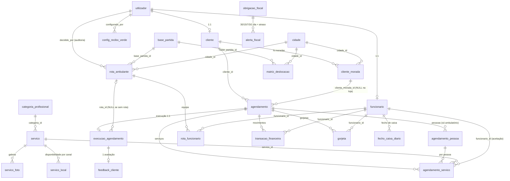

# Especificação — Dados, arquitetura e API

<!-- md-wrap-tables:max=220 -->

> Parte da especificação. Router e índice: [`especificacao_mvp.md`](../../../especificacao_mvp.md).
> Capítulos: §17 · §18 · §19

## 17. MODELO DE DADOS

**Total: 24 tabelas** na base `secade_beauty` (`DataBase_v2.sql`).

### 17.1 Núcleo — utilizadores e perfis
| Tabela                      | Notas                                                                |
| :-------------------------- | :------------------------------------------------------------------- |
| `utilizador`                | Tabela mãe. `tipo_perfil` ∈ {cliente, funcionario, gestor}           |
| `cliente`                   | 1:1 com `utilizador`; `telemovel_validado_otp`                       |
| `funcionario`               | 1:1 com `utilizador`; `tipo_contrato`, `salario_base`, `cc`, `ativo` |
| `cliente_morada`            | N por cliente; `principal` (1 = principal)                           |
| ~~`funcionario_categoria`~~ | ⚠️ **REMOVIDA** (v3.0) — ver §3.2                                    |

> ⚠️ **Não existe tabela `gestor`** — o gestor vive em `utilizador` com `tipo_perfil='gestor'`
> (`ManagerRepository` consulta `utilizador`).

### 17.2 Catálogo
| Tabela                   | Notas                                                                                    |
| :----------------------- | :--------------------------------------------------------------------------------------- |
| `categoria_profissional` | 3 linhas (Cabeleireiro, Barbearia, Estética)                                             |
| `servico`                | 35 linhas. `preco_base`, `duracao_estimada_minutos`, `requer_espaco_fisico`, **`ativo`** |
| `servico_local`          | Disponibilidade por canal (`loja_fisica` / `carrinha_ambulante`)                         |
| `servico_foto`           | Galeria de imagens (a alimentar — D-06)                                                  |

### 17.3 Geografia e logística
| Tabela              | Notas                                                                                                           |
| :------------------ | :-------------------------------------------------------------------------------------------------------------- |
| `cidade`            | 10 linhas (distrito de Évora). Colunas reais: `id`, `nome`, `distrito` (a cobertura deriva dos dados inseridos) |
| `base_partida`      | 1 linha (Évora)                                                                                                 |
| `matriz_deslocacao` | 9 linhas: `distancia_km`, `tempo_estimado_minutos`, `custo_estimado_combustivel`                                |

### 17.4 Agendamento (núcleo do MVP)
| Tabela                | Notas                                                                                                                                                                       |
| :-------------------- | :-------------------------------------------------------------------------------------------------------------------------------------------------------------------------- |
| `agendamento`         | Cabeçalho. `local_prestacao`, `data_hora_pretendida`, `estado_reserva`, `cliente_id`, `cliente_morada_id` (NULL na loja), `valor_total`, `valor_sinal`, `sinal_pago`,       |
|                       | `validado_logistica_loja`, etc.                                                                                                                                             |
| `agendamento_pessoa`  | Pessoas de um agendamento de ambulatório (`nome_pessoa`, `observacoes`) — **sem registos na loja**                                                                          |
| `agendamento_servico` | Um registo por (agendamento, pessoa, serviço). Contém preços, durações, estado de aceitação, funcionário atribuído, e valores calculados para recibos verdes (funcionário e |
|                       | plataforma)                                                                                                                                                                 |

> ⚠️ **`agendamento` NÃO tem `cidade_id` nem `rota_ambulante_id`.**
> A cidade é derivada por JOIN: `agendamento → cliente_morada → cidade`.
> A ligação à rota é feita por **(data, cidade)** em `rota_ambulante`, não por FK.

### 17.5 Operação
| Tabela                 | Notas                                                                                                                                                               |
| :--------------------- | :------------------------------------------------------------------------------------------------------------------------------------------------------------------ |
| `execucao_agendamento` | Registo de execução (1 por agendamento)                                                                                                                             |
| `feedback_cliente`     | Avaliação (1 por execução/agendamento)                                                                                                                              |
| `rota_ambulante`       | `estado_rota` ∈ {planeada, aprovada, recusada, em_execucao, concluida}; custos, lucros, e dados de auditoria (`decidido_por`, `decidido_em`, `observacoes_decisao`) |
| `rota_funcionario`     | Alocação de funcionários à rota                                                                                                                                     |

> ⚠️ **Não existe coluna `decisao`** em `rota_ambulante` — a decisão é gravada em `estado_rota`
> como `aprovada`/`recusada`.

### 17.6 Financeiro e fiscal
| Tabela                 | Notas                                                                                         |
| :--------------------- | :-------------------------------------------------------------------------------------------- |
| `config_recibo_verde`  | Percentagens + vigência por data                                                              |
| `obrigacao_fiscal`     | IVA, IRC, SS, Seguros; `periodicidade`, `prazo`, `valor_estimado`, `estado`, `data_pagamento` |
| `alerta_fiscal`        | `tipo_alerta` ∈ {30_dias, 15_dias, 7_dias, 3_dias, 1_dia, em_atraso}; `mensagem`, `lido`      |
| `transacao_financeira` | Movimentos (incl. tipo `quota_parte_deslocacao`) — **sem UI no MVP**                          |
| `fecho_caixa_diario`   | Auditoria de caixa — **sem UI no MVP**                                                        |
| `gorjeta`              | Registos de gorjeta — **sem UI no MVP**                                                       |

### 17.7 Ficheiros SQL e ordem de importação
| Ficheiro                         | Função                                                                                                                                                          |
| :------------------------------- | :-------------------------------------------------------------------------------------------------------------------------------------------------------------- |
| **`DataBase_v2.sql`**            | Dump **completo** (24 tabelas + dados de referência) — **1.º**                                                                                                  |
| **`database_seed.sql`**          | Utilizadores de teste + morada — **2.º (obrigatório)**                                                                                                          |
| `database_migration_v2.sql`      | Migração v1→v2 (**uso único**, só em BD v1 com dados)                                                                                                           |
| `database_migration_v3.sql`      | Migração v2→v3 (**idempotente**): `servico.ativo`, `cliente.morada` anulável, **drop de `funcionario_categoria`**                                               |
| ~~`DataBase.sql`~~               | Dump v1 (21 tabelas) — ❌ não usar                                                                                                                              |
| ~~`DataBase_backup_pre_v2.sql`~~ | Arquivo histórico — ❌ não usar. ⚠️ Está em **UTF-16 LE** (dump legado do HeidiSQL); reconverter para UTF-8 (`iconv -f UTF-16LE -t UTF-8`) se for necessário no |
|                                  | futuro                                                                                                                                                          |

Detalhe operacional de importação em **§27**.

### 17.8 Diagrama de relações (BD exportada)

> Gerado a partir das **30 chaves estrangeiras reais** (`information_schema.KEY_COLUMN_USAGE`).
> Serve de *diagrama de BD exportado* (documentação obrigatória). Para regenerar:
> ```sql
> SELECT TABLE_NAME, COLUMN_NAME, REFERENCED_TABLE_NAME
> FROM information_schema.KEY_COLUMN_USAGE
> WHERE TABLE_SCHEMA='secade_beauty' AND REFERENCED_TABLE_NAME IS NOT NULL
> ORDER BY TABLE_NAME, COLUMN_NAME;
> ```



**Tabelas sem relação (ou relação parcial) — atenção:**
| Tabela                                                                                          | Observação                                                                                     |
| ----------------------------------------------------------------------------------------------- | ---------------------------------------------------------------------------------------------- |
| `execucao_servico`                                                                              | **Sem FK alguma** (tabela de detalhe por serviço, ainda sem consumidor)                        |
| `cidade`, `base_partida`, `categoria_profissional`, `servico`, `utilizador`, `obrigacao_fiscal` | São **referenciadas** mas não referenciam ninguém (tabelas "pai")                              |
| `agendamento`                                                                                   | ⚠️ **não** tem FK para `cidade` nem para `rota_ambulante` — a cidade é derivada via            |
|                                                                                                 | `cliente_morada` e a ligação à rota é por **(data, cidade)**                                   |
| `rota_ambulante`                                                                                | A cidade do grupo entra por `cidade_id`, mas os agendamentos que constituem a rota **não** são |
|                                                                                                 | gravados como filhos (a rota é um agregado calculado)                                          |

## 18. ARQUITETURA E CONVENÇÕES

### 18.1 Camadas e fluxo
```
View (PHP) → JS componente → api.js → api.php (routing) → Controller → Service → Repository (+Mapper) → MySQL
```

| Camada         | Responsabilidade                                                                                             | Ficheiros                               |
| :------------- | :----------------------------------------------------------------------------------------------------------- | :-------------------------------------- |
| **Controller** | Recebe o pedido, **autoriza** e delega. **Sem regras de negócio**                                            | `app/controllers/` (+`BaseController`)  |
| **Service**    | Validação, orquestração/**transações**, regras de negócio, composição de outros Services. **Sem SQL inline** | `app/services/` (+`BaseService`)        |
| **Repository** | SQL com **prepared statements**                                                                              | `app/repositories/` (+`BaseRepository`) |
| **Mapper**     | Tradução BD (PT, snake_case) → código (EN, camelCase) + casting                                              | `app/mappers/` (+`BaseMapper`)          |
| **Utils**      | `Validator`, `ValidationException`, `Session`                                                                | `app/utils/`                            |
| **Config**     | `config.php`, `connection.php`, **`api.php`** (tabela de rotas)                                              | `app/config/`                           |

**Front Controller:** `index.php` — distingue **API** (`?action=…` / path `api`) de **página**
(tabela de rotas com suporte a `:param`).

### 18.2 Repository
- Estende `BaseRepository` com `fetch`, `fetchAll`, `fetchRaw`, `fetchAllRaw`, `execute`, `exists`,
  `lastInsertId` — **todos com prepared statements**.
- Aplica **automaticamente o Mapper** associado (`protected ?string $mapper = XMapper::class;`).
- **JOINs permitidos em SELECT** quando servem para **enriquecer** a linha da tabela principal com
  dados de lookup (**N:1**): ex. `servico LEFT JOIN categoria_profissional`, `cliente_morada LEFT JOIN cidade`.
  - **Não** usar JOINs para **composição de coleções filhas (1:N)** — isso é feito no Service.
- **Escrita (INSERT/UPDATE/DELETE) estritamente na própria tabela.**
- Filtros dinâmicos: `WHERE 1=1` + concatenação condicional de `:params` nomeados.
- Convenção de métodos: `find(?int $id = null, …)` (sem id → lista; com id → 1 registo),
  `create(...)`, `update*()`, `delete(...)`, `count*()`, `findBy*()`.
- **`fetch`/`fetchAll`** → entidades (mapper aplicado). **`fetchRaw`/`fetchAllRaw`** →
  **agregações, lookups e COUNT/SUM** (sem mapper). *(Adicionados porque o mapper descartava as
  chaves agregadas da viabilidade das rotas.)*

### 18.3 Mapper
- `BaseMapper::cast($coluna_bd, $chave_saida, $tipo)` em `mapRow()`; tipos: `int`, `float`, `string`, `bool`.
- **Campos vindos de JOINs são mapeados aqui** (ex.: `categoria_nome` → `categoryName`).
- `BaseMapper::map($data)` trata linha única, lista e vazio/null.
- ⚠️ **`cast()` omite chaves com valor `NULL`** — o consumidor deve usar `?? null`.

### 18.4 Service
- Estende `BaseService`: `validate($data, fn($v) => …)` (via `Validator`) e
  `executeTransactional(callable)` — **transação aninhável** (o Service exterior controla).
- Instancia os seus Repositories no construtor e **pode invocar outros Services** para composição
  (padrão do registo de cliente: `CustomerService` → `UserService` + `CustomerRepository` + `CustomerAddressService`).
- ⚠️ **`Validator::custom()`**: a verificação falha quando o callable devolve **`true`**
  (é um predicado de erro). Ex.: unicidade de email → `fn($e) => !empty($repo->find(null, $e))`.

### 18.5 Contrato de nomes front-end ↔ API

> 🔗 **Fonte única: `.clinerules` §2** — regra, tabela de chaves corretas (EN, camelCase) versus
> chaves legadas (PT, snake_case) e o validator que a verifica (`dev/tests/asset_test.php`).
> Aqui mantém-se apenas o princípio, por ser decisão de arquitetura: **a API dita o contrato; o
> front-end adapta-se**, e o português fica reservado à BD.

### 18.6 Segurança e acesso por perfil

> 🔗 **Regras de implementação** (401/403, `prepared statements`, *hashing* de passwords, `hash_equals`
> no OTP): **`.clinerules` §2**. Este documento guarda o **modelo de acesso** — quem pode o quê — que
> é regra de negócio.

**Matriz de acesso por perfil (verificada em testes):**

| Perfil          | Acesso                                                                                                                                                                  |
| --------------- | ----------------------------------------------------------------------------------------------------------------------------------------------------------------------- |
| **Cliente**     | Main + `customer-*`, `booking-*`, `feedback-create`/`feedback-my`. **401** sem sessão; **403** nas APIs `admin-*`; **redirect** nas páginas `/gestao/*`                 |
| **Funcionário** | `admin-service-*` (só em nome próprio); **403** em rotas, fiscal e recibos verdes. Páginas: `/gestao/servicos` e `/gestao/agendamentos`                                 |
| **Gestor**      | Todas as `admin-*` (agendamentos, rotas, fiscal, recibos verdes). Páginas: todos os menus de gestão. ⚠️ **403** nas APIs `admin-service-*` (aceitação é do funcionário) |
| **Sem sessão**  | Só endpoints públicos (`city-supported`, `category-all`, `booking-services`, `feedback-list`, `booking-availability`, `auth-*`)                                         |

### 18.7 Front-end

> 🔗 **Fonte única: `.clinerules` §2** — `form.utils.js` + validators, `API.*`/`ApiClient`, forma das
> respostas JSON, tratamento de erros, **jq-preloader** e `generalUtils`. Aqui mantém-se o essencial
> por ser contrato entre camadas: as respostas **não** vêm aninhadas em `data` — as chaves estão na
> **raiz** do JSON (`array_merge(["success"=>true], $responsedata)`).

### 18.8 Nomenclatura, idioma e restrições técnicas

> 🔗 **Fonte única: `.clinerules` §2** (nomenclatura e idioma) e **`.clinerules` §1** (restrições de
> execução). As tabelas e a lista de restrições **não se repetem aqui** — ver lá.

### 18.9 Inventário da implementação (por camada)

> Ficheiros **criados ou estendidos** na implementação do MVP. Serve de mapa de manutenção:
> onde procurar cada responsabilidade.

**Backend — novo**

| Camada     | Ficheiros                                                                                                                                                                        |
| ---------- | -------------------------------------------------------------------------------------------------------------------------------------------------------------------------------- |
| Mapper     | `RotaMapper`, `ExecutionMapper`, `FiscalObligationMapper`, `FiscalAlertMapper`, `FeedbackMapper`, `GreenReceiptConfigMapper`                                                     |
| Repository | `RotaRepository`, `ExecutionRepository`, `FiscalObligationRepository`, `FiscalAlertRepository`, `FeedbackRepository`                                                             |
| Service    | `RotaService`, `ServiceAcceptanceService` (Fase 3), `GreenReceiptService` (Fase 3), `FiscalService` (Fase 4), `ExecutionService`, `FeedbackService` (Fase 2)                     |
| Controller | `RotaController`, `AdminController`, `CustomerController`, `CustomerAddressController`, `ServiceController` (Fase 3), `FiscalController` (Fase 4), `FeedbackController` (Fase 2) |

**Backend — estendido**
- `BookingRepository`: listagem de backoffice (filtros data/local/estado/cidade + paginação),
  agrupamento de pendentes por dia+cidade, `updateEstadoMany()`, `findAmbulatoryGroups()`
- `BookingService`: `listBookings()`, `cancelBooking()` (guardas 404/409), `listActiveServices()`
- `api.php`: 9 novos endpoints (`customer-*`, `admin-*`)
- `index.php`: novas rotas `perfil`, `agendamentos`, `agendar`, `agendamento-sucesso`,
  `gestao/agendamentos`, `gestao/rotas` (+ `gestao/servicos`, `gestao/fiscal`, `gestao/recibos-verdes`)

**Frontend — Main (cliente)**
- `modules/main/services.php` + `components/services.php` — catálogo com filtros, modal e *skeleton*
- `modules/main/js/components/services.js` (**era vazio**) — filtros, modal, integração com `/agendar?services=`
- `modules/main/booking.php` + `components/bookingWizard.php` — wizard com os passos
  `services`, `channel`, `address`, `otp`, `datetime`, `professional` (loja), `policy` (carrinha), `summary`
- `modules/main/js/components/bookingWizard.js` — fluxos por canal (5 vs 7 passos), slots dinâmicos,
  OTP, construtor de pessoas, resumo e submissão
- `modules/common/js/validators/booking.validator.js` (novo)
- `modules/main/bookingSuccess.php` (novo)
- `modules/main/profile.php` + `js/components/profile.js` — perfil e CRUD de moradas
- `modules/main/appointments.php` + `js/components/appointments.js` — histórico com filtros + feedback
- `modules/common/js/api/api.js` — namespaces `booking`, `customer`, `admin`, `feedback`
- `modules/common/js/utils/general.utils.js` — `formatCurrency`, `formatDuration`, `formatDateTime`
- Navbar com entrada "Agendar"; CSS do catálogo/wizard/backoffice

**Frontend — Backoffice**
- `includes/{boHeader,boNavbar,boFooter}.php` + `js/bo.js`, `js/bo.utils.js`
  — **menu dinâmico por perfil**: funcionário (Serviços, Agendamentos) vs. gestor
  (Agendamentos, Rotas, Fiscal, Recibos Verdes)
- `appointments.php` + `js/components/appointments.js` — tabela, filtros, paginação,
  **detalhe por serviço/funcionário**, execução, cancelamento
- `routes.php` + `js/components/routes.js` — **decisão manual**, indicador de 50 €
- `services.php` + `js/components/services.js` — **Fase 3**: aceitação individual, desfazer, recibo verde
- `fiscal.php` + `js/components/fiscal.js` — **Fase 4**: calendário, alertas progressivos, marcar pago
- `greenReceipts.php` + `js/components/greenReceipts.js` — **Fase 3**: configuração do simulador

**Base de dados**
- `database_migration_v3.sql` (novo, **idempotente**): `servico.ativo`; `cliente.morada` opcional;
  **remoção de `funcionario_categoria`** (passo 3)
- `database_seed.sql` (novo, **idempotente**): gestor, funcionário, cliente + morada em Évora (*bcrypt*)
- `DataBase.sql` / `DataBase_v2.sql`: alinhados com `ativo`; `DataBase_v2.sql` sem `funcionario_categoria`

**Testes**
- `dev/tests/{functional_test,http_test,asset_test,js_syntax_check}.php` — **289 verificações** (§26)

**Ferramentas de desenvolvimento**
- `dev/tools/` — utilitários de manutenção dev-only (encoding, formatação/validação de `.md`,
  edição segura de ficheiros). **Não faz parte da aplicação** — catálogo e utilização em
  `dev/tools/README.md`; onde a pasta vive está em `.clinerules` §4.

### 18.10 Fluxo de Git

> 🔗 **Fonte única: `.clinerules` §4** — modelo de branches (`main` / `dev` / `agent-workspace` /
> restantes), regras do agente (nunca commitar em `main` nem em `dev`; integração sempre por
> merge/PR e por decisão do utilizador), regra de ouro contra conflitos por branch de contexto e
> convenção das mensagens de commit. **Não se repete aqui.**

### 18.11 Ferramentas de manutenção (`dev/tools/`)

> 🔗 **Fonte única: `dev/tools/README.md`** — catálogo das ferramentas, opções, convenções comuns
> (*dry-run* por omissão, `--write`, *exit code*, execução a partir da raiz), garantias do pipeline
> `.md`, pragmas e a ordem correta de execução. **Não se repete aqui.** Onde a pasta vive: `.clinerules` §4.

### 18.12 Branch `agent-workspace` (relação agente/humano)

> 🔗 **Fonte única: `.clinerules` §4** — conteúdo da branch, a regra de nunca ser integrada, o
> comportamento do `.gitignore` e o uso de `git add -f`. **Não se repete aqui.**

## 19. API / ENDPOINTS

**Padrão:** `?action=<dominio>-<acao>` · **37 endpoints** registados em `app/config/api.php`.
Resposta de sucesso: `{"success":true, …chaves na raiz}`; erro: `{"success":false,"message":"…"}`
(+ `errors` por campo em **422**).

### 19.1 Públicos e de cliente
| Endpoint                         | Método | Descrição                                           | Acesso         |
| :------------------------------- | :----- | :-------------------------------------------------- | :------------- |
| `auth-register`                  | POST   | Registo (cliente público; gestor pode criar perfis) | público        |
| `auth-login` / `auth-logout`     | POST   | Gestão de sessão                                    | público / auth |
| `city-supported`                 | GET    | Listagem das 10 cidades                             | público        |
| `category-all`                   | GET    | Listagem das 3 categorias profissionais             | público        |
| `booking-services`               | GET    | Catálogo de serviços ativos                         | público        |
| `feedback-list`                  | GET    | Feedback público (testemunhos)                      | público        |
| `booking-availability`           | GET    | Consulta de slots (data + duração + canal)          | público*       |
| `booking-otp-request`            | POST   | Pedido de OTP (devolve código no ecrã)              | cliente        |
| `booking-create-store`           | POST   | Cria agendamento de loja                            | cliente        |
| `booking-create-amb`             | POST   | Cria agendamento de ambulatório (com validação OTP) | cliente        |
| `booking-my`                     | GET    | Consulta de agendamentos do cliente                 | cliente        |
| `customer-profile`               | GET    | Dados de perfil e moradas do cliente                | cliente        |
| `customer-address-list`          | GET    | Listagem de moradas                                 | cliente        |
| `customer-address-store`         | POST   | Registo de nova morada                              | cliente        |
| `customer-address-set-principal` | POST   | Definição de morada principal                       | cliente        |
| `customer-address-delete`        | POST   | Remoção de morada                                   | cliente        |
| `feedback-my`                    | GET    | Estado do feedback do cliente                       | cliente        |
| `feedback-create`                | POST   | Submissão de nova avaliação                         | cliente        |

\* `booking-availability` não exige sessão, mas devolve apenas grelha de horários (sem dados pessoais).

### 19.2 Backoffice — funcionário
| Endpoint                      | Método | Descrição                                                      | Acesso      |
| :---------------------------- | :----- | :------------------------------------------------------------- | :---------- |
| `admin-service-pending-list`  | GET    | Serviços de ambulatório por aceitar                            | funcionário |
| `admin-service-accepted-list` | GET    | Serviços aceites pelo funcionário + totais                     | funcionário |
| `admin-service-accept`        | POST   | Aceitar serviço (inclui cálculo de recibo verde)               | funcionário |
| `admin-service-unaccept`      | POST   | Desfazer / trocar atribuição (bloqueia com 409 se consolidado) | funcionário |

### 19.3 Backoffice — gestor
| Endpoint                          | Método | Descrição                                                               |
| :-------------------------------- | :----- | :---------------------------------------------------------------------- |
| `admin-appointments-list`         | GET    | Agendamentos (com filtros e paginação)                                  |
| `admin-appointment-details`       | GET    | Detalhe por serviço/funcionário, progresso e registo de execução        |
| `admin-appointment-cancel`        | POST   | Cancelar agendamento (retorna erro 409 se em estados terminais)         |
| `admin-appointment-execute`       | POST   | Registar execução do agendamento (operação idempotente)                 |
| `admin-routes-list`               | GET    | Rotas por dia e cidade com custos, lucros e indicador `meetsReference`  |
| `admin-route-decide`              | POST   | Aprovar ou recusar rota de forma manual                                 |
| `admin-fiscal-calendar-list`      | GET    | Calendário fiscal com geração on-demand de alertas                      |
| `admin-fiscal-alert-list`         | GET    | Listagem de alertas fiscais progressivos                                |
| `admin-fiscal-obligation-create`  | POST   | Criar nova obrigação fiscal (retorna erro 422 se dados inválidos)       |
| `admin-fiscal-obligation-paid`    | POST   | Marcar obrigação como paga (validações 404 e 409)                       |
| `admin-fiscal-alert-read`         | POST   | Marcar alertas fiscais como lidos                                       |
| `admin-green-receipt-config`      | GET    | Consultar configuração de recibos verdes em vigor                       |
| `admin-green-receipt-config-save` | POST   | Guardar configuração de recibos verdes (erro 422 se a soma não for 100) |
| `admin-green-receipt-simulate`    | GET    | Simular distribuição de valores de recibos verdes para um dado montante |

### 19.4 Matriz de códigos HTTP
| Situação                               | Código HTTP       |
| :------------------------------------- | :---------------- |
| Sessão ausente / não autenticado       | **401**           |
| Perfil sem permissão (não autorizado)  | **403**           |
| Recurso inexistente                    | **404**           |
| Endpoint inexistente / método errado   | **404** / **405** |
| Conflito / violação de regra de estado | **409**           |
| Erro de validação (com lista `errors`) | **422**           |

### 19.5 Endpoints **previstos e não implementados** (futuro — §25)
- `customer-booking-cancel` (cancelamento pelo cliente — §24.6)
- `client-alert-*` (lembretes ao cliente — §24.6)
- `admin-deposit-config` (configuração do sinal — §24.5)
- `admin-payment-*` (cobrança dos 90 % + método — §24.5)
- `admin-supplier-*` (**Fornecedores — prioridade máxima entre os futuros** — §25)
