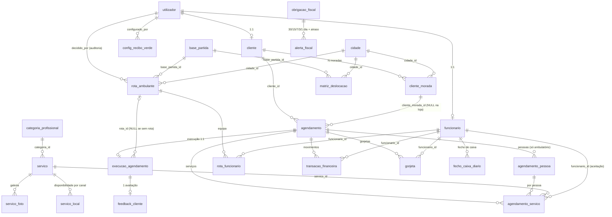

# SECADE BEAUTY — ESPECIFICAÇÃO ÚNICA E CENTRALIZADA
**Documento-mestre (single source of truth)** · Versão 1.1 · 22/09/2026 · branch **`agent-workspace`**
**Âmbito:** requisitos, decisões finais, arquitetura, base de dados, API, estados, testes e instalação.

> ⚠️ **PREVALÊNCIA:** este documento **centraliza e substitui** a informação de requisitos,
> convenções e decisões que estava dispersa pelos restantes `.md` do projeto. Em caso de
> contradição com qualquer outro ficheiro, **vale o que está aqui**.
> Os ficheiros anteriores são **registo histórico** — ver §29.2. Nesta branch (`agent-workspace`)
> foram **eliminados**; em `dev` continuam presentes (a remoção é reversível com
> `git checkout dev -- <ficheiro>`).

> **Fontes consolidadas** (ficheiros **entretanto eliminados** na consolidação documental — mapa em §29.2):
> `planeamento_geral.md` · `rectificacoes.md` (esclarecimento de conflitos
> com os `.pdf` iniciais) · `fluxo_funcionalidades.md` · `CARRINHA_SPEC.md` ·
> `plano_desenvolvimento.md` · `ALTERACOES_PRIORIDADES.md` · `duvidas_planeamento.md` ·
> `relatorio_alteracoes.md` · `tecnologias_projeto.md` · `LOGIN_PROFILE_TODO.md` ·
> `README.md` · `relatorio_implementacao.md`.

---

## ÍNDICE

| §   | Secção                            | §   | Secção                                    |
| :--- | :-------------------------------- | :--- | :---------------------------------------- |
| 1   | Visão geral, contexto e stack     | 16  | Feedback do cliente                       |
| 2   | Regras de Ouro (prevalência)      | 17  | Modelo de dados                           |
| 3   | Conflitos e decisões finais       | 18  | Arquitetura e convenções                  |
| 4   | Requisitos funcionais (RF)        | 19  | API / endpoints                           |
| 5   | Regras de negócio (RN)            | 20  | Máquina de estados                        |
| 6   | Domínio: utilizadores e perfis    | 21  | Roadmap por fases e estado                |
| 7   | Catálogo de serviços e categorias | 22  | Simplificações e limitações               |
| 8   | Agendamento — Loja Física         | 23  | Defeitos corrigidos (histórico)           |
| 9   | Agendamento — Carrinha Ambulante  | 24  | **Requisitos novos / gap analysis**       |
| 10  | Dinâmica dos funcionários         | 25  | Trabalho futuro priorizado                |
| 11  | Simulador de Recibos Verdes       | 26  | Testes e validação                        |
| 12  | Módulo do Gestor — Rotas          | 27  | Instalação e importação da BD             |
| 13  | Calendário Fiscal                 | 28  | Critérios de aceitação                    |
| 14  | Pagamentos, sinal e recibos       | 29  | Anexos (glossário, histórico, manutenção) |
| 15  | Cancelamentos e janela de 24h     |     |                                           |

---

## 0. COMO USAR ESTE DOCUMENTO

| Se quer…                                                         | Vá a                         |
| :--------------------------------------------------------------- | :--------------------------- |
| Saber **o que o sistema faz**                                    | §4 (RF) + §5 (RN)            |
| Saber **porque uma regra é assim** (e não como os `.pdf` diziam) | §3                           |
| Implementar um **módulo**                                        | §6–§16                       |
| Escrever **código**                                              | §18 (convenções) + §19 (API) |
| **Fazer commits / integrar código**                              | §18.10 (fluxo de Git)        |
| **Perceber as branches (main / dev / agent-workspace)**          | §18.10 + §18.12              |
| **Editar/escrever ficheiros (encoding seguro)**                  | §18.11 (`tools/`)            |
| Perceber **estados**                                             | §20                          |
| Saber **o que falta fazer**                                      | §24 (gap) + §25 (futuro)     |
| **Instalar/importar**                                            | §27                          |
| **Testar**                                                       | §26 + §28                    |

**Convenção de identificadores:** `RF-nn` (requisito funcional), `RN-nn` (regra de negócio),
`D-nn` (decisão final documentada). Referências cruzadas usam estes identificadores.

---

## 1. VISÃO GERAL, CONTEXTO E STACK

**Secade Beauty** é um sistema de agendamentos para um negócio híbrido de beleza:
- **Loja Física** em Évora — Terça a Sábado, 09:00–19:00
- **Serviço Ambulatório** (domicílio / carrinha itinerante) — cidades do distrito de Évora

**Público-alvo:** idosos com mobilidade reduzida, famílias rurais e clientes que procuram
serviços de beleza e bem-estar acessíveis.

**Problema que resolve:** levar o serviço ao cliente (em vez de exigir deslocação),
mantendo uma loja física como base e oferecendo gestão de rotas, equipa e obrigações fiscais
num backoffice único.

### 1.1 Stack tecnológica (fixa — sem frameworks externos)

| Camada         | Tecnologia                                                             |
| :------------- | :--------------------------------------------------------------------- |
| Backend        | **PHP puro** 7.4+ (executado em 8.3) + **PDO** com prepared statements |
| Base de dados  | **MySQL 8.4.3** (Community Server)                                     |
| Arquitetura    | **MVC custom** (Controller → Service → Repository + Mapper)            |
| Frontend       | HTML5, CSS3, **JavaScript vanilla ES6+**, jQuery 3.x                   |
| UI             | **Bootstrap 5.0.0**, Bootstrap Icons / Font Awesome                    |
| Bibliotecas UI | Owl Carousel 2, WOW.js + Animate.css, Lightbox, Isotope                |
| Ambiente       | Laragon (Apache 2.4 + MySQL + PHP), HeidiSQL, VS Code                  |
| Charset / TZ   | UTF-8 · `Europe/Lisbon`                                                |
| Idioma         | **Código em inglês · Base de dados em português**                      |

**Base URL local:** `http://localhost/secade-beauty-tarde`

## 2. REGRAS DE OURO (PREVALÊNCIA ABSOLUTA)

### A. Separação Main vs. Backoffice
- **Main** (`modules/main/`): exclusivo para **clientes**. Catálogo, perfil, agendamentos, feedback.
  **Nenhum fluxo do Main expõe** dados de gestão, funcionários, rotas, fiscalidade ou recibos verdes.
- **Backoffice** (implementado em `modules/backoffice/`): área restrita por perfil —
  **gestor** (agendamentos, rotas, fiscal, config. de recibos verdes) e
  **funcionário** (aceitação de serviços). O cliente **não tem acesso**.

### B. Dois canais de agendamento com regras distintas

| Aspeto               | **Loja Física**                          | **Carrinha Ambulante**                        |
| :------------------- | :--------------------------------------- | :-------------------------------------------- |
| Espaço físico        | Exige (`requer_espaco_fisico=1` só aqui) | Não                                           |
| Morada               | ❌ Não pede                              | ✅ Obrigatória (define a cidade/rota)         |
| Estrutura por pessoa | ❌ Não                                   | ✅ Obrigatória (Pessoa 1..N)                  |
| OTP                  | ❌ Não                                   | ✅ Simulado, 6 dígitos                        |
| Aceitação            | **Automática** na criação                | **Manual** por funcionário, serviço a serviço |
| Estado inicial       | `pendente_validacao_logistica_loja`      | `pendente_aceitacao_funcionarios`             |
| Sinal                | **10%** (simulado)                       | **Dispensado** na 1.ª marcação                |
| Horário              | Ter–Sáb 09:00–19:00                      | Flexível (ver D-nn §3.9)                      |

### C. Categorias são apenas filtros visuais
Cabeleireiro, Barbearia e Estética funcionam **estritamente como agrupadores visuais/filtros**
(no Main para o cliente, no backoffice para o funcionário). **Nunca** condicionam quem pode
executar o quê — qualquer funcionário aceita qualquer serviço.

### D. A equipa é atribuída por aceitação, não por alocação automática
Não há motorista dedicado nem controlo logístico de condução. A carrinha é transporte; uma vez
estacionada na morada, os serviços são executados **polivalentemente** por qualquer funcionário
presente (§3.8).

### E. Decisões de gestão são manuais
A decisão de rotas é **manual e livre** do gestor. Valores de referência (50 €) são **indicadores
visuais** e nunca gatilhos automáticos. Alertas fiscais são gerados **on-demand** (sem CRON).

---

## 3. CONFLITOS E DECISÕES FINAIS

> Esta secção consolida os **esclarecimentos de retificações** (ficheiro eliminado — §29.2): os conflitos entre os **`.pdf` iniciais**
> (de contabilidade/operação) e os `.md` de planeamento, mais os conflitos **internos** entre
> `.md`. Regra geral aplicada: **prevalece o `.md`** (planeamento v3.0 + esclarecimentos),
> com as nuances operacionais abaixo.

### 3.1 — D-01 · Decisão de rotas e limiar financeiro
- **Conflito:** o PDF definia validação **obrigatória** de viabilidade com **cancelamento
  automático** quando os limiares mínimos não fossem atingidos. Os `.md` revogaram esse algoritmo.
- **Decisão final:** a decisão de aprovar ou recusar é **inteiramente do gestor**.
  O valor de referência (**50 €**) serve **apenas** de apoio visual/alerta. **Sem bloqueio automático.**
- **Implementação:** `RotaService::decideRoute()` + `REFERENCE_PROFITABILITY = 50.0`
  (devolvido como `meetsReference`). O antigo `validateRoutes()` e o endpoint
  `admin-validate-routes` foram **removidos**.

### 3.2 — D-02 · Funcionários ↔ categorias profissionais
- **Conflito:** o PDF indicava alocação dinâmica **estritamente baseada nas categorias** dos
  serviços agendados. Os `.md` eliminaram a relação N:N.
- **Decisão final:** categorias são **apenas filtros e agrupadores visuais**; os profissionais
  têm **total liberdade** para aceitar qualquer serviço.
- **Implementação:** tabela `funcionario_categoria` **removida** (schema com **24 tabelas**).
  `funcionario` guarda apenas `tipo_contrato`, `salario_base`, `cc`, `ativo`.

### 3.3 — D-03 · Política salarial vs. recibos verdes
- **Conflito:** o PDF referia **salários fixos** para todos os funcionários, sem cálculo
  automático de comissões. Os `.md` integram um **Simulador de Recibos Verdes** (70/30).
- **Decisão final:** prevalece o `.md`, **com esta nuance operacional**:
  - Funcionários com **contrato fixo** atuam **predominantemente na loja física**.
  - Funcionários a **recibo verde** atuam na vertente **ambulante** e estão sujeitos ao
    simulador de aceitação por serviço.
- **Estado:** o simulador está implementado (§11); a **regra de encaminhamento por
  `tipo_contrato`** (loja vs. ambulatório) e a sua expressão na UI **estão por implementar**
  (§24.3).

### 3.4 — D-04 · Estrutura da frota móvel
- **Conflito:** o PDF sugeria **3 carrinhas** (uma por área: cabeleireiro, barbearia, estética).
- **Decisão final:** **uma única carrinha polivalente**, para otimizar o investimento inicial,
  transportando a equipa independentemente das especialidades originais.
- **Implementação:** `base_partida` única (base 1 = Évora) + `matriz_deslocacao` base→cidade.

### 3.5 — D-05 · Percentagem do sinal de reserva
- **Conflito:** o PDF mencionava **10% ou 50%** de sinal prévio.
- **Decisão final:** **10% exclusivamente na loja física**, com **gestão e configuração
  centralizadas no backoffice**; a **1.ª marcação em ambulatório é isenta**
  (para mitigar barreiras de entrada de novos clientes).
- **Estado:** os 10% estão implementados como **constante de código** (`DEPOSIT_PERCENTAGE = 10`)
  — a **configuração no backoffice está por implementar** (§24.5 / §24.6).

### 3.6 — D-06 · Interface e apresentação do catálogo
- **Conflito/dúvida:** existia referência a uma framework visual externa (**AdminLTE**) e dúvidas
  sobre a forma de exibição do catálogo.
- **Decisão final:**
  - **Ignorar completamente a menção ao AdminLTE.**
  - A informação dos serviços é apresentada em **cards**.
  - Obrigatoriamente uma **página de detalhes dedicada por serviço** (não apenas um modal),
    encimada por um **carousel de imagens** do procedimento/resultados, com **descrição detalhada**
    e **estimativa padrão do tempo de execução** (ex.: *Corte de Cabelo: 45 min*).
- **Estado:** existe **apenas um modal** de detalhes na página do catálogo; a página dedicada com
  carousel **está por implementar** (§24.2). A tabela `servico_foto` já existe (sem conteúdo/UI).

### 3.7 — D-07 · Escolha da hora e dinâmica de tempos
- **Conflito/dúvida:** o cliente escolhe uma **hora exata** de uma lista, ou uma **janela ampla**
  (blocos de 2 horas)?
- **Decisão final:**
  - O cliente escolhe a **hora inicial a partir de uma lista de horas disponíveis**, gerada com
    base nos **agendamentos consolidados** dessa cidade (aplica-se ao **ambulatório**;
    **irrelevante** para a loja física, onde a cidade não é preenchida nem relevante).
  - O **tempo estimado é re-avaliado dinamicamente** sempre que o cliente adiciona ou descarta
    serviços durante o preenchimento do formulário — usando/reaproveitando a **validação de
    disponibilidade server-side** já existente.
  - Garante-se **estruturalmente** que a escolha da hora ocorre **estritamente após a seleção dos
    serviços** (passo seguinte do formulário), para evitar colisões temporais.
- **Estado:** a ordem (serviços → canal → data/hora) **já está garantida** e a validação
  server-side **existe na submissão** (409 em conflito). Porém, **alterar serviços depois de
  escolher a data não recarrega a lista de slots** (`loadSlots()` só corre no `change` de
  `#bookingDate`) → **a melhorar** (§24.1).

### 3.8 — D-08 · Logística de condução e papel dos funcionários
- **Conflito/dúvida:** os funcionários acumulavam funções de motorista? Existia controlo logístico
  de condução?
- **Decisão final:**
  - **Não existe conceito de motorista dedicado** nem qualquer lógica de controlo de condução na
    plataforma. **Não deve ser implementado nada a esse respeito.**
  - A carrinha funciona estritamente como **meio de transporte**; uma vez estacionada na morada do
    cliente, os serviços são executados **de forma polivalente por qualquer funcionário presente**,
    independentemente de especialidades restritas.
- **Estado:** conforme — **nada a fazer**.

### 3.9 — D-09 · Flexibilidade horária e rotas multicidades
- **Conflito/dúvida:** como gerir horários rígidos face a rotas complexas ou extensas?
- **Decisão final:**
  - **Horários da carrinha são tendencialmente flexíveis** — não coincidem necessariamente com os
    da loja. A flexibilidade é tratada como **exceção**: se o término de um agendamento exceder
    ligeiramente o limite padrão do fim do dia (**19:00**), o sistema deve **permitir**.
  - **Rotas multicidades são permitidas** (ex.: *Évora → Arraiolos → Évora*), mas **não são a
    norma**, desde que os agendamentos estejam **cronologicamente ordenados** e o sistema valide
    na BD se existe **espaçamento de tempo suficiente** para a deslocação física segura entre
    cidades. A listagem de agendamentos do gestor deve permitir **incluir agendamentos de outras
    cidades num grupo**, desde que os intervalos de tempo não colidam com os já selecionados
    (verificar em BD se já existe informação de deslocação utilizável — `matriz_deslocacao`).
  - **Alerta de custos:** como as deslocações multicidades aumentam significativamente os custos de
    combustível (**igualmente divididos entre os clientes no pagamento final**), o backoffice
    apresenta um **alerta padronizado de custos e viabilidade** junto ao indicador de referência
    dos 50 €. A **zona de alertas das listagens do backoffice deve ser padronizada/convencionada**
    e definida neste documento (§12.4).
- **Estado:** **por implementar** — o horário é hoje **bloqueado** a 19:00 em ambos os canais
  (`validateStoreOpeningHours`), o agrupamento é **fixo** por dia+cidade, e não existe alerta de
  custos nem convenção de alertas (§24.4).

### 3.10 — D-10 · Pagamentos, sinal (10/90), simulação e falhas de internet
- **Conflito/dúvida:** regras de divisão de pagamentos, falhas de rede no terreno e emissão de
  recibos.
- **Decisão final:**
  - Mantém-se a política de **sinal de 10%** no agendamento, com **configuração generalizada numa
    secção dedicada do backoffice**.
  - Os restantes **90% são cobrados no término do serviço** (implementar o que faltar).
  - No MVP **todos** os pagamentos e opções (**Dinheiro, Multibanco, MB Way**) são **simulados de
    forma realista** (*dummy*) — sem processo oficial. É desejável **simular a escolha do método de
    pagamento** de forma realista, com as opções fornecidas.
  - Em **falhas de internet no terreno**, o pagamento é simulado com **restrição a numerário**.
  - A **emissão de recibos manuais** é tratada como **possível implementação futura**
    (a alinhar com as restantes melhorias) — **avaliar primeiro se já está tratada** no MVP.
- **Estado:** só o **sinal de 10%** está implementado (simulado, sem escolha de método).
  **Faltam:** cobrança dos 90 %, escolha simulada do método, cenário de falha de internet e
  configuração do sinal no backoffice (§24.5).

### 3.11 — D-11 · Cancelamentos, janela de 24 horas e notificações
- **Conflito/dúvida:** como tratar cancelamentos de última hora, penalizações e o destino de
  agendamentos não incluídos em rotas?
- **Decisão final:**
  - **Nenhum gestor pode criar rotas com agendamentos a menos de 24 horas** da execução.
    Esses agendamentos devem ser **automaticamente descartados/cancelados** da rota.
  - Se um agendamento **atingir a marca das 24 horas sem ter sido incluído numa rota**, é
    **automaticamente descartado/cancelado** das **listagens ativas** (não aparece na aceitação
    por funcionários nem na inclusão em rotas), mas é **retido na base de dados** por motivos de
    retenção de informação (para algoritmos e simuladores futuros).
  - O sistema despoleta um **alerta/lembrete automático ao cliente**, informando da
    impossibilidade de execução e sugerindo alternativas *user-friendly* (deslocação à **loja
    física** ou **reagendamento**). O lembrete é gerado quando falta **≤ 24 h** e o agendamento
    **não foi incluído em nenhuma rota**.
  - O cliente **pode cancelar o seu agendamento pela plataforma**. Se o fizer **após** estar
    associado a uma rota (respeitando a antecedência), **não recebe qualquer penalização
    financeira**.
- **Estado:** **por implementar integralmente** — a regra das 24 h não existe, o
  auto-cancelamento não existe, o lembrete não existe e o **cliente não tem forma de cancelar**
  (só existe `admin-appointment-cancel`, restrito a gestor) → §24.6.
- **Nota de coerência:** este ponto **substitui** a resolução antiga registada nas dúvidas de planeamento
  §5.4 ("a rota decide-se em qualquer momento, sem prazo-limite"), que passa a ter o limite
  operacional das 24 h.

### 3.12 — Reforços transversais (dos esclarecimentos de retificações)
- **AdminLTE:** ignorar (reforço de D-06).
- **Módulos abrangentes do dashboard:** definir bem neste documento, mas **partir do que já existe**
  nos `.md` e no MVP implementado; **adaptar o backoffice** para seguir a **mesma estrutura** dos
  menus já existentes e tratar o resto como **implementações futuras** (§25).
  **Nota:** qualquer implementação futura **sobre Fornecedores deve ser priorizada.**
- **Configuração do sinal:** deve existir uma **secção no backoffice** para configurar o sinal
  inicialmente cobrado aos clientes — **verificar se já existe secção apropriada e, se possível,
  generalizar uma secção existente** em vez de criar uma nova (§24.5).
- **Cancelamento pelo cliente:** confirmar se existe; **deve existir** (§3.11 / §24.6).
- **Catálogo multimédia:** os serviços são mostrados em cards; pretende-se **página de detalhes**
  com **carousel** por cima da informação (reforço de D-06 / §24.2).

### 3.13 — Conflitos internos entre `.md` (resolvidos nesta consolidação)
> **Nota de rastreabilidade:** os ficheiros citados na coluna *Fontes* foram **eliminados** nesta
> consolidação (mapa em §29.2). As citações mantêm-se para se saber **de onde vinha** cada conflito;
> o conteúdo original continua recuperável pelo histórico do Git (`git show <revisão>:<ficheiro>`).

| #   | Conflito                                                   | Fontes                                                     | Resolução                                                        |
| :--- | :--------------------------------------------------------- | :--------------------------------------------------------- | :--------------------------------------------------------------- |
| 1   | Limiar automático de **100 €**                             | `fluxo_funcionalidades.md`, `CARRINHA_SPEC.md`, etc.       | **REVOGADO** → decisão manual + 50 € visual (§3.1)               |
| 2   | "Funcionário deve cobrir todas as categorias"              | `fluxo_funcionalidades.md` (RN04 antiga)                   | **REVOGADA** → categorias = filtros (§3.2)                       |
| 3   | Estado `pendente_aprovacao_viabilidade`                    | `fluxo_funcionalidades.md`, `ALTERACOES_PRIORIDADES.md`    | Substituído por `pendente_aceitacao_funcionarios` /              |
|     |                                                            |                                                            | `pendente_validacao_logistica_loja` (§20)                        |
| 4   | Wizard de loja com **profissional obrigatório** e imediato | `fluxo_funcionalidades.md` (Step 4)                        | Substituído: sem passo de profissional; estado                   |
|     |                                                            |                                                            | `pendente_validacao_logistica_loja` (§8)                         |
| 5   | Wizard carrinha de **7 steps** com profissional e sinal    | `CARRINHA_SPEC.md`                                         | Wizard com morada + OTP + estrutura por pessoa; sinal dispensado |
|     |                                                            |                                                            | (§9)                                                             |
| 6   | Cronograma de **7 dias**                                   | `plano_desenvolvimento.md`, `ALTERACOES_PRIORIDADES.md`,   | Substituído por **roadmap por fases** (§21)                      |
|     |                                                            | `README.md`                                                |                                                                  |
| 7   | Backoffice na pasta raiz **`admin/`**                      | `planeamento_geral.md` §2.A/§13, `relatorio_alteracoes.md` | Implementado em **`modules/backoffice/`**; migração = trabalho   |
|     |                                                            |                                                            | futuro (§25)                                                     |
| 8   | "Repositories **sem JOINs**"                               | `.clinerules`, `tecnologias_projeto.md`                    | Revisto: **JOINs N:1 de lookup permitidos** em SELECT; escrita   |
|     |                                                            |                                                            | própria (§18.1)                                                  |
| 9   | Rotas decididas **sem prazo-limite**                       | `duvidas_planeamento.md` §5.4                              | **Substituído** pela janela de 24 h (§3.11)                      |
| 10  | Sinal **50%**                                              | PDF inicial                                                | **REVOGADO** → 10 % fixo na loja (§3.5)                          |
| 11  | **3 carrinhas**                                            | PDF inicial                                                | **REVOGADO** → 1 carrinha polivalente (§3.4)                     |

## 4. REQUISITOS FUNCIONAIS (RF)

Legenda de estado: ✅ implementado · 🟡 parcial · ⬜ por implementar

### 4.1 Main — público e cliente

| ID    | Requisito                                                                           | Estado                  |
| :---- | :---------------------------------------------------------------------------------- | :---------------------- |
| RF-01 | Home com hero, "Acerca", categorias e **testemunhos** (reais + fallback estático)   | ✅                      |
| RF-02 | Páginas institucionais: Sobre, Contacto                                             | ✅                      |
| RF-03 | Página 404 personalizada                                                            | ✅                      |
| RF-04 | Listagem de **categorias** (3 cards)                                                | ✅                      |
| RF-05 | **Catálogo** de serviços em cards com filtros (categoria, preço, duração, pesquisa) | ✅                      |
| RF-06 | Badge **"Apenas Loja"** quando `requer_espaco_fisico=1`                             | ✅                      |
| RF-07 | **Página de detalhes dedicada por serviço** com **carousel** + tempo estimado       | ⬜ (§3.6)               |
| RF-08 | Registo de cliente (wizard) com autocomplete de morada e cidade suportada           | ✅                      |
| RF-09 | Login / logout / recuperar password                                                 | 🟡 (recuperar = página) |
| RF-10 | Perfil do cliente: dados + **CRUD de moradas** (principal, criar, remover)          | ✅                      |
| RF-11 | Meus Agendamentos: histórico com filtros por estado                                 | ✅                      |
| RF-12 | **Cancelamento do agendamento pelo cliente**                                        | ⬜ (§3.11)              |
| RF-13 | **Alerta/lembrete** ao cliente (≤ 24 h, sem rota) com sugestão de loja/reagendar    | ⬜ (§3.11)              |
| RF-14 | Feedback do cliente após execução (1–5★ + comentário)                              | ✅                      |

### 4.2 Agendamento — Loja Física

| ID    | Requisito                                                          | Estado          |
| :---- | :----------------------------------------------------------------- | :-------------- |
| RF-20 | Wizard: serviços → canal → data/hora → resumo (sem morada/pessoas) | ✅              |
| RF-21 | Slots de 30 min, Terça–Sábado, 09:00–19:00                         | ✅              |
| RF-22 | Serviços **automaticamente aceites** na criação                    | ✅              |
| RF-23 | Sinal de **10 %** (simulado)                                       | ✅              |
| RF-24 | Validação de conflito de janela na criação (409)                   | ✅              |
| RF-25 | **Configuração do sinal no backoffice** (substituir constante)     | ⬜ (§3.5/§3.12) |

### 4.3 Agendamento — Carrinha Ambulante

| ID    | Requisito                                                               | Estado                 |
| :---- | :---------------------------------------------------------------------- | :--------------------- |
| RF-30 | Wizard com **morada** (10 cidades) + **OTP** + **estrutura por pessoa** | ✅                     |
| RF-31 | OTP simulado: 6 dígitos, visível no ecrã, expira em 10 min, uso único   | ✅                     |
| RF-32 | Duração e valor **por pessoa** (serviços partilhados contam por pessoa) | ✅                     |
| RF-33 | Estado inicial `pendente_aceitacao_funcionarios`                        | ✅                     |
| RF-34 | Sinal **dispensado** (1.ª marcação)                                     | 🟡 (dispensado sempre) |
| RF-35 | **Re-avaliar a disponibilidade ao alterar serviços** após escolher data | 🟡 (§3.7)              |
| RF-36 | **Flexibilidade horária como exceção** (fim > 19:00 permitido)          | ⬜ (§3.9)              |

### 4.4 Backoffice — Funcionário

| ID    | Requisito                                                                               | Estado |
| :---- | :-------------------------------------------------------------------------------------- | :----: |
| RF-40 | Lista "Por aceitar" (ambulatório pendente), agrupada por agendamento → pessoa → serviço | ✅     |
| RF-41 | Filtros **visuais** por categoria e data                                                | ✅     |
| RF-42 | **Aceitação individual** serviço a serviço                                              | ✅     |
| RF-43 | **Desfazer** e **trocar** aceitação enquanto não consolidado (403/409)                  | ✅     |
| RF-44 | **Consolidação** ao aceitar o último serviço + **bloqueio da janela temporal**          | ✅     |
| RF-45 | **Simulador de Recibos Verdes** apresentado na aceitação                                | ✅     |
| RF-46 | Lista "Aceites por mim" + totais                                                        | ✅     |

### 4.5 Backoffice — Gestor

| ID    | Requisito                                                                   | Estado     |
| :---- | :-------------------------------------------------------------------------- | :--------: |
| RF-50 | Lista de agendamentos com filtros (data, local, estado, cidade) + paginação | ✅         |
| RF-51 | Detalhe por **serviço/funcionário** + progresso de aceitação + execução     | ✅         |
| RF-52 | Cancelamento de agendamento                                                 | ✅         |
| RF-53 | Registo de **execução** do serviço (idempotente)                            | ✅         |
| RF-54 | Rotas por **dia+cidade** com custos/lucros e **indicador 50 €** (visual)    | ✅         |
| RF-55 | **Decisão manual** de rota (aprovar/recusar) com auditoria                  | ✅         |
| RF-56 | **Rotas multicidades** (ordenação cronológica + validação de espaçamento)   | ⬜ (§3.9)  |
| RF-57 | **Alerta padronizado de custos/viabilidade** nas listagens                  | ⬜ (§3.9)  |
| RF-58 | **Regra das 24 h** na criação de rotas                                      | ⬜ (§3.11) |
| RF-59 | **Auto-cancelamento** de agendamentos a 24 h sem rota (retidos na BD)       | ⬜ (§3.11) |
| RF-60 | Calendário Fiscal (IVA, IRC, SS, Seguros) + alertas 30/15/7/3/1/atraso      | ✅         |
| RF-61 | Configuração do Simulador de Recibos Verdes (percentagens + vigência)       | ✅         |
| RF-62 | **Configuração do sinal** cobrado aos clientes                              | ⬜ (§3.12) |
| RF-63 | **Dashboard/resumo** e estrutura de menus convencionada por módulo          | 🟡 (§25)   |

### 4.6 Pagamentos (simulados)

| ID    | Requisito                                                         | Estado     |
| :---- | :---------------------------------------------------------------- | :--------: |
| RF-70 | Sinal 10 % simulado na criação                                    | ✅         |
| RF-71 | **Cobrança dos 90 %** no término do serviço                       | ⬜ (§3.10) |
| RF-72 | **Escolha simulada do método** (Dinheiro / Multibanco / MB Way)   | ⬜ (§3.10) |
| RF-73 | Cenário de **falha de internet** → pagamento restrito a numerário | ⬜ (§3.10) |
| RF-74 | Recibo manual — avaliar se existe; caso não, **trabalho futuro**  | ⬜ (§25)   |

## 5. REGRAS DE NEGÓCIO (RN)

### 5.1 Regras vigentes

| ID    | Regra                                                                                                 | Onde é aplicada                                            |
| :---- | :---------------------------------------------------------------------------------------------------- | :--------------------------------------------------------- |
| RN-01 | Serviços com `requer_espaco_fisico=1` → **só loja física**                                            | Catálogo + wizard (bloqueia carrinha)                      |
| RN-02 | Loja: **Terça a Sábado, 09:00–19:00**, slots de **30 min**                                            | `BookingService::validateBookingDate` + `findAvailability` |
| RN-03 | **Sinal de 10 %** na loja; **dispensado** na 1.ª marcação em ambulatório                              | `BookingService::createStoreBooking`                       |
| RN-04 | **Categorias são apenas filtros visuais** (aceitação livre)                                           | Backoffice funcionário (UI)                                |
| RN-05 | **Decisão de rotas manual**; 50 € é **apenas indicador visual** (`meetsReference`)                    | `RotaService::decideRoute`                                 |
| RN-06 | **Aceitação individual** serviço a serviço; o último aceite **consolida** (`totalmente_aceite`)       | `ServiceAcceptanceService::consolidateIfComplete`          |
| RN-07 | **Desfazer/trocar** permitido **apenas enquanto** o agendamento **não** estiver consolidado (409)     | `ServiceAcceptanceService::unacceptService`                |
| RN-08 | A consolidação **bloqueia a janela temporal** para agendamentos concorrentes                          | `countByDateWindow` + `assertNoWindowConflict`             |
| RN-09 | Na aceitação corre o **Simulador de Recibos Verdes** com a percentagem em vigor (70/30)               | `GreenReceiptService`                                      |
| RN-10 | Decisão de rota: `aprovada` → agendamentos `confirmado`; `recusada` → `cancelado`                     | `RotaService::decideRoute`                                 |
| RN-11 | **Calendário Fiscal**: alertas progressivos **30/15/7/3/1 dia** + atraso, geração idempotente         | `FiscalService::generateAlerts`                            |
| RN-12 | **Feedback** só após serviço **executado**, **uma vez** por agendamento, e é **público**              | `FeedbackService::createFeedback`                          |
| RN-13 | Duração e valor do ambulatório somados **por pessoa** (serviço partilhado conta por pessoa)           | `BookingService::resolveServicesForPeople`                 |
| RN-14 | **Uma morada por agendamento** de ambulatório (`agendamento.cliente_morada_id`)                       | `BookingService::createAmbulatoryBooking`                  |
| RN-15 | A **cidade** deriva da morada (`cliente_morada → cidade`)                                             | `BookingRepository::findAmbulatoryGroups`                  |
| RN-16 | OTP: **6 dígitos**, expira em **10 min**, **uso único**, validado na **sessão**                       | `OTPService::request/verify`                               |
| RN-17 | Serviços de **loja** não podem ser aceites no backoffice de funcionário (409)                         | `assertAcceptableBooking`                                  |
| RN-18 | Rota **recusada** → **todos** os agendamentos dessa cidade+dia passam a `cancelado`                   | `RotaService::decideRoute`                                 |
| RN-19 | A decisão é sempre sobre a **rota inteira** (dia+cidade) — não há rotas parciais                      | `RotaService::decideRoute`                                 |
| RN-20 | Obrigações fiscais: valor **manual**; `periodicidade` ∈ {mensal, trimestral, anual}; pagar grava data | `FiscalService`                                            |
| RN-21 | **Um registo por (agendamento, pessoa, serviço)** em `agendamento_servico`                            | `BookingService`                                           |
| RN-22 | Percentagem dos recibos verdes aplica-se ao **`preco_praticado`**; alterações afetam aceitações       | `GreenReceiptService`                                      |
| RN-23 | A **cobrança de 90 %** ocorre no **término do serviço** (a implementar)                               | §24.5                                                      |
| RN-24 | Nenhum gestor cria rota com agendamentos a **menos de 24 h** (a implementar)                          | §24.6                                                      |
| RN-25 | Agendamento a **24 h sem rota** → **auto-cancelado** das listagens, **retido na BD** (a implementar)  | §24.6                                                      |
| RN-26 | Cliente **pode cancelar**; após associação a rota, **sem penalização financeira** (a implementar)     | §24.6                                                      |
| RN-27 | **Multicidades** permitido com validação de **espaçamento temporal** entre cidades (a implementar)    | §24.4                                                      |
| RN-28 | Carrinha: **flexibilidade horária como exceção** (fim > 19:00 permitido) (a implementar)              | §24.4                                                      |
| RN-29 | Em pagamento com **falha de internet**, apenas **numerário** (a implementar)                          | §24.5                                                      |

### 5.2 Regras **revogadas** (não implementar)

| ID (antigo)   | Regra revogada                                                                                  | Substituto                                                                     |
| :------------ | :---------------------------------------------------------------------------------------------- | :----------------------------------------------------------------------------- |
| ~~RN04 (v1)~~ | "Funcionário deve cobrir todas as categorias necessárias"                                       | RN-04                                                                          |
| ~~RN05 (v1)~~ | "Rentabilidade mínima de rotas: **100 €** (aprova/cancela automaticamente)"                     | RN-05                                                                          |
| —             | Estado `pendente_aprovacao_viabilidade`                                                         | `pendente_aceitacao_funcionarios`                                              |
| —             | Sinal de **50 %**                                                                               | RN-03 (10 %)                                                                   |
| —             | **3 carrinhas** dedicadas por área                                                              | 1 carrinha polivalente                                                         |
| —             | Passo obrigatório de **profissional** na loja                                                   | Informativo (equipa por aceitação)                                             |
| —             | **JOINs proibidos** em repositories                                                             | Permitido N:1 de lookup (§18.1)                                                |
| —             | Cronograma de **7 dias**                                                                        | Roadmap por fases (§21)                                                        |
| —             | Decisão de rota **sem prazo-limite**                                                            | RN-24 (janela de 24 h)                                                         |
| —             | Estados `pendente_aprovacao_viabilidade`, `aprovada_viabilidade`, `cancelada_por_rentabilidade` | `pendente_aceitacao_funcionarios` → decisão manual → `confirmado`/`cancelado`  |
|               | (v1)                                                                                            |                                                                                |
| —             | Coluna `rota_ambulante.valor_rentabilidade_calculado` (v1)                                      | `lucro_total` + `meetsReference` (indicador visual)                            |
| —             | Marcar `cliente.telemovel_validado_otp = 1` como efeito do OTP do agendamento (v1)              | OTP do ambulatório é **por pedido** (sessão, uso único); não altera o cadastro |
| —             | "CRUD de Serviços" como objetivo do MVP                                                         | Catálogo é **somente leitura** no Main; gestão de catálogo fora do âmbito      |

## 6. DOMÍNIO: UTILIZADORES E PERFIS

| Entidade             | Descrição                                                                       | Campos-chave                                                                           |
| :------------------- | :------------------------------------------------------------------------------ | :------------------------------------------------------------------------------------- |
| **`utilizador`**     | Conta base dos 3 perfis                                                         | `nome`, `email`, `password_hash` (**bcrypt**), `telemovel`, `nif`, `tipo_perfil`       |
| **`cliente`**        | Herança de `utilizador` (1:1)                                                   | `telemovel_validado_otp`                                                               |
| **`funcionario`**    | Herança de `utilizador` (1:1)                                                   | `tipo_contrato` (`efetivo_contratado` / `recibo_verde`), `salario_base`, `cc`, `ativo` |
| **`gestor`**         | ⚠️ **Não tem tabela própria** — vive em `utilizador` com `tipo_perfil='gestor'` | —                                                                                      |
| **`cliente_morada`** | N moradas por cliente                                                           | `designacao`, `rua`, `numero_porta`, `andar_bloco`, `codigo_postal`, `principal`,      |
|                      |                                                                                 | `cidade_id`                                                                            |

**Perfis em uso:** `cliente`, `funcionario`, `gestor` (enum em `utilizador.tipo_perfil`).

**Regra de ouro de acesso (§2.A):**
- Sem sessão → **401** nas APIs / **redirect** para `/login` nas páginas.
- Perfil errado → **403** nas APIs / **redirect** nas páginas.

**Nuance D-03 (§3.3):** funcionários com contrato fixo atuam predominantemente na **loja**;
a recibo verde, na vertente **ambulante**. Esta correspondência **ainda não é imposta** pelo sistema.

---

## 7. CATÁLOGO DE SERVIÇOS E CATEGORIAS

- **35 serviços** em **3 categorias**: Cabeleireiro, Barbearia, Estética.
- **Preços:** 4,07 € – 48,78 €.
- **Campos-chave de `servico`:** `nome`, `descricao`, `categoria_id`, `duracao_estimada_minutos`,
  `preco_base`, `requer_espaco_fisico`, `ativo`.
- `requer_espaco_fisico=1` → disponível **apenas em loja** (1 serviço nestas condições).
- **`servico_local`** parametriza a disponibilidade por canal (`loja_fisica` / `carrinha_ambulante`).
- **`servico_foto`** existe para a galeria de imagens (a alimentar — ver D-06 / §24.2).
- **Categorias = filtros/agrupadores visuais** (nunca condicionam quem executa o quê).

**Apresentação:** cards no catálogo com filtros (categoria, preço, duração, pesquisa) e badge
"Apenas Loja"; **página de detalhes dedicada por serviço** (carousel + descrição + tempo estimado)
— D-06.

**Exemplo de referência para testes:** Barba (20 min, 4,07 €) · Design de Sobrancelha com Linha
(30 min, 8,13 €).

---

## 8. AGENDAMENTO — LOJA FÍSICA

### 8.1 Wizard (Main) — 5 passos
1. **Seleção de serviços** — checkboxes múltiplos, mínimo 1; cálculo automático de duração e valor.
2. **Escolha do canal** — "Loja Física".
3. **Data e hora** — calendário Terça–Sábado; slots de 30 min entre 09:00 e 19:00;
   a API valida disponibilidade.
4. **Profissional** — passo **informativo** ("Sem preferência"); a equipa é atribuída por aceitação,
   porque a BD não associa funcionários a slots.
5. **Resumo e confirmação** — serviços, data/hora, local, valores, sinal de 10 %.

**Sem** passo de morada, **sem** estrutura por pessoa.

### 8.2 Regras de criação
- Todos os serviços ficam **imediatamente aceites** (`estado_aceitacao='aceite'`) — **sem**
  intervenção de funcionários.
- Estado após criação: **`pendente_validacao_logistica_loja`** (validação de capacidade/logística,
  visível no backoffice do gestor, que pode cancelar).
- **Sem** bloqueio por "totalmente aceite por funcionários" (não se aplica à loja).
- **Validação de conflito:** `countByDateWindow(..., 'loja_fisica')` considera a **duração total**
  e conta os estados `pendente_validacao_logistica_loja`, `totalmente_aceite_funcionarios` e
  `confirmado` → **409** se houver sobreposição.
- **Sinal:** `valor_sinal = valor_total × 10 %` (simulado; `sinal_pago` permanece `0`).
- **Campos gravados:** `local_prestacao='loja_fisica'`, `cliente_morada_id = NULL`,
  `agendamento_servico.agendamento_pessoa_id = NULL`, sem registos em `agendamento_pessoa`.

### 8.3 Exemplo trabalhado (usado nos testes)
```
Barba (4,07 € · 20 min) + Design de Sobrancelha (8,13 € · 30 min)
  valor_total = 12,20 €   ·   valor_sinal = 1,22 € (10 %)
  duração     = 50 min    ·   data: Terça a Sábado, futura
  → 2 registos em agendamento_servico, ambos 'aceite'
```
> ⚠️ Na **loja** os serviços **não** são duplicados por pessoa (não existem pessoas).

## 9. AGENDAMENTO — CARRINHA AMBULANTE

### 9.1 Wizard (Main) — 7 passos + OTP
1. **Seleção de serviços** — apenas serviços sem `requer_espaco_fisico`.
2. **Escolha do canal** — "Carrinha Ambulante" (bloqueado se algum serviço exigir espaço físico).
3. **2B — Morada:** cidade (dropdown das 10 cidades suportadas), rua, número, código postal.
   A **cidade deriva da morada** e define a rota.
4. **2C — OTP simulado:** código de 6 dígitos mostrado no ecrã; validado antes de prosseguir.
5. **3 — Data e hora** do slot (por **lista de horas disponíveis**, ver D-07).
6. **4 — Política de sinal:** informado que a 1.ª marcação é **dispensada**; aceitação de termos.
7. **5 — Estrutura por pessoa + Resumo:** Pessoa 1..N, cada uma com os seus serviços.
   → agendamento criado em **`pendente_aceitacao_funcionarios`**.

### 9.2 Estrutura por pessoa (regra central)
- Os serviços são agrupados **obrigatoriamente por pessoa** (Pessoa 1, Pessoa 2, …) — funciona como
  **agrupador logístico e visual** para estimar a **duração total do slot no terreno**.
- **Várias pessoas podem usufruir dos mesmos serviços** (ou de serviços diferentes).
- **Pessoa 1** vem pré-preenchida com o nome do cliente autenticado; podem ser adicionados
  familiares **sem conta**. Validação: nome + ≥ 1 serviço por pessoa. Sem limite imposto.
- **Modelo de dados:** **um registo por (agendamento, pessoa, serviço)**.

### 9.3 Fórmulas (críticas)
```
duração_total = Σ (duração dos serviços POR PESSOA,
                   sem duplicar DENTRO da mesma pessoa)
valor_total   = Σ (preço de cada serviço POR PESSOA)

Exemplo de referência (usado nos testes):
  Pessoa 1: [Barba 20 min · 4,07 €]                →  20 min ·  4,07 €
  Pessoa 2: [Barba 20 min · 4,07 € | Design 30 min · 8,13 €] → 50 min · 12,20 €
  ────────────────────────────────────────────────────────────────────────
  TOTAL                                              70 min · 16,27 €
  valor_sinal = 0,00 € (dispensado)
```
> ⚠️ **Ponto crítico:** o mesmo serviço pedido por duas pessoas conta **duas vezes**.
> (Foi corrigido um defeito em que a deduplicação entre pessoas subestimava valor e duração.)

### 9.4 Regras pós-criação
- Cada serviço (por pessoa) fica **individualmente disponível para aceitação** no backoffice (§10).
- **Sem aprovação automática de rentabilidade** na criação.
- **Validação de conflito:** `countByDateWindow(..., 'carrinha_ambulante')` com a duração total.

### 9.5 OTP — ciclo de vida

| Passo              | Comportamento                                                                                      |
| :----------------- | :------------------------------------------------------------------------------------------------- |
| Pedido             | `OTPService::request()` gera 6 dígitos, guarda na **sessão** (`expiresAt = now + 600 s`) e devolve |
| Validação cliente  | `booking.validator.js` confirma formato 6 dígitos imediatamente                                    |
| Validação servidor | `OTPService::verify()` — compara cliente da sessão, expiração e código (`hash_equals`)             |
| Consumo            | No sucesso o código é **removido da sessão** → **uso único**                                       |
| Erro               | Código inválido/expirado → **422**; sem pedido prévio → **422**                                    |

### 9.6 Limitações conhecidas
- A lista de horas disponíveis **não é recarregada** se o cliente alterar os serviços depois de
  escolher a data → **a melhorar** (D-07 / §24.1).
- O horário é hoje **rígido** 09:00–19:00 também para a carrinha → falta a **exceção** de D-09 (§24.4).

---

## 10. DINÂMICA DOS FUNCIONÁRIOS (BACKOFFICE)

### 10.1 Listagem e filtros
- O funcionário vê os serviços de ambulatório **pendentes**, agrupados por
  **agendamento → pessoa → serviço**.
- Filtros: **categoria** e **data** — **apenas visuais/agrupadores** (RN-04).

### 10.2 Aceitação individual
- A aceitação é **por serviço individual** (não por agendamento nem por pessoa).
- No momento da aceitação é apresentado o **Simulador de Recibos Verdes** (§11).
- Grava em `agendamento_servico`: `funcionario_id`, `estado_aceitacao='aceite'`, `aceito_em`,
  `percentagem_funcionario_aplicada`, `valor_recibo_verde_funcionario`, `valor_recibo_verde_plataforma`.
- **Troca:** aceitar um serviço já aceite por **outro** funcionário **transfere-o** (`isSwap`).

### 10.3 Desfazer / trocar
- Permitido **enquanto** o agendamento não estiver **`totalmente_aceite_funcionarios`**.
- Só o funcionário que aceitou pode desfazer (**403** se não for ele).
- Se o agendamento já estiver consolidado → **409** ("não permite desfazer nem trocar").

### 10.4 Consolidação
- Assim que o **último serviço** é aceite, o agendamento transita para
  **`totalmente_aceite_funcionarios`** (transacional).
- Nesse momento: **(a)** bloqueia trocas/desistências e **(b)** bloqueia **agendamentos
  concorrentes na mesma janela temporal**.

### 10.5 Concorrência de janela temporal
- Ao consolidar, o sistema reserva o slot (data/hora + duração total) e recusa agendamentos novos
  ou aceitações que colidam com essa janela (`assertNoWindowConflict` → **409**).
- Estados considerados como "ocupantes": `pendente_validacao_logistica_loja`,
  `totalmente_aceite_funcionarios`, `confirmado`.

### 10.6 Capacidade de funcionários por slot
- A disponibilidade baseia-se na **ausência de conflito de janela**, e **não** no número de
  funcionários — porque a equipa é atribuída por **aceitação**, não por alocação prévia.
- Consequência conhecida: não há limite de aceitações por funcionário no mesmo slot; a coordenação
  é operacional (a equipa que vai na carrinha é que executa — D-08).

## 11. SIMULADOR DE RECIBOS VERDES

- **Gatilho:** apresentado **no momento da aceitação** de cada serviço de **ambulatório**
  (na loja não há aceitação por funcionários).
- **Percentagens configuráveis pelo gestor** (por omissão: **70 % funcionário / 30 % plataforma**),
  com **vigência por data** (`config_recibo_verde`).
- **Base de cálculo:** `preco_praticado` do **serviço individual**, no momento da aceitação.
- **Fórmulas:**
  ```
  valor_recibo_verde_funcionario = preco_praticado × (pct_funcionario / 100)
  valor_recibo_verde_plataforma  = preco_praticado × (pct_plataforma  / 100)
  ```
  Exemplo: Barba 4,07 € a 70/30 → funcionário **2,85 €** · plataforma **1,22 €**.
- **Persistência:** os valores ficam gravados no próprio **`agendamento_servico`**
  (`percentagem_funcionario_aplicada`, `valor_recibo_verde_funcionario`,
  `valor_recibo_verde_plataforma`); as percentagens vivem em `config_recibo_verde`.
- **Recálculo:** alterar a percentagem afeta **apenas aceitações futuras**; as já registadas mantêm
  os valores gravados.
- **Validação:** a soma das percentagens tem de ser **100** → **422** caso contrário.
- **Âmbito académico:** é um **simulador** — **não há emissão real** na Segurança Social.
- **Configuração no backoffice:** endpoint `admin-green-receipt-config` e página
  `/gestao/recibos-verdes` (histórico de configurações + simulador de valores).
- **Nuance D-03 (§3.3):** a regra "recibo verde → ambulatório / contrato fixo → loja" **ainda não é
  aplicada** pelo sistema; hoje qualquer funcionário pode aceitar ambulatório.

---

## 12. MÓDULO DO GESTOR — ROTAS

### 12.1 Listagem
- **Agrupamento:** **dia + cidade**.
- **Filtro por defeito** na gestão de agendamentos: ambulatório **"Totalmente Aceite por
  Funcionários"**; opção de ver **pendentes**.
- **Detalhe do agendamento:** que funcionários estão associados a **cada serviço** (por pessoa),
  progresso de aceitação e registo de execução.

### 12.2 Indicadores por grupo (rota)

| Indicador                   | Origem / fórmula                                                                 |
| :-------------------------- | :------------------------------------------------------------------------------- |
| **Receita prevista**        | `SUM(agendamento.valor_total)` dos agendamentos do grupo                         |
| **Custo de combustível**    | `matriz_deslocacao.custo_estimado_combustivel` (base 1 = Évora)                  |
| **Custo fixo operacional**  | **50 €** (`FIXED_OPERATIONAL_COST`)                                              |
| **Custo total**             | combustível + 50 €                                                               |
| **Lucro/rentabilidade**     | receita − custo total                                                            |
| **Quota-parte do cliente**  | `rota_ambulante.quota_parte_cliente` — 0 € (sem regra definida; **não** cobrada) |
| **Indicador de referência** | `meetsReference = rentabilidade ≥ 50 €` → **apenas visual**                      |

### 12.3 Decisão manual (núcleo do módulo)
- **Aprovar** → agendamentos do grupo passam a **`confirmado`**; rota gravada com
  `estado_rota='aprovada'`.
- **Recusar** → **todos** os agendamentos do grupo passam a **`cancelado`**; rota com
  `estado_rota='recusada'`; mensagem de **notificação simulada** ao cliente com alternativas.
- **Auditoria gravada:** `decidido_por`, `decidido_em`, `observacoes_decisao`
  (nota automática com a rentabilidade quando o gestor não escreve nada).
- **Sem CRON** e **sem limiar automático**: o gestor decide livremente, mesmo abaixo dos 50 €.
- **Prova de manualidade (testes):** aprovar uma rota **abaixo** dos 50 € → fica `confirmado`;
  recusar uma rota **acima** → fica `cancelado`.

### 12.4 Convenção da zona de alertas (listagens do backoffice) — D-09
Convenção **obrigatória** para uniformizar alertas em todas as listagens (rotas, agendamentos,
fiscal, serviços):

| Nível           | Classe Bootstrap | Uso                                                                                       | Bloqueia ação?   |
| :-------------- | :--------------- | :---------------------------------------------------------------------------------------- | :--------------- |
| **Informativo** | `alert-info`     | Contexto neutro (ex.: "rota de 3 agendamentos")                                           | Não              |
| **Atenção**     | `alert-warning`  | Rentabilidade abaixo da referência; **multicidades** (custos acrescidos); perto do limite | **Não**          |
| **Crítico**     | `alert-danger`   | Conflito de janela, dados inválidos, obrigação fiscal em atraso                           | Não (só informa) |

**Regras de composição:**
- Posição: **acima** da listagem/tabela; nas rotas, **imediatamente junto** ao indicador de 50 €.
- Estrutura: `ícone + título curto + (detalhe opcional) + (ação opcional)`.
- **Nunca** bloqueiam a decisão manual do gestor (RN-05) — são apoio à decisão.
- Reutilizar o mesmo componente/markup em todos os módulos (não criar variações por página).

### 12.5 Rotas multicidades (a implementar — ver §24.4)
- Permitidas mas **não são a norma**; exigem **ordenação cronológica** e validação de
  **espaçamento temporal suficiente** para a deslocação entre cidades
  (usar `matriz_deslocacao.tempo_estimado_minutos`).
- A listagem do gestor deve permitir **adicionar agendamentos de outras cidades** ao grupo,
  desde que não colidam com os intervalos já selecionados.
- Padrão de exemplo: `Évora → Évora → [deslocação] → Arraiolos → Arraiolos → [regresso] → Évora`.

## 13. CALENDÁRIO FISCAL

- **Centralizado no backoffice do gestor** (`/gestao/fiscal`).
- **Obrigações:** **IVA, IRC, Segurança Social, Seguros**.
- **Dados por obrigação:** designação, tipo, `valor_estimado` (**introduzido manualmente**),
  `periodicidade` (mensal / trimestral / anual), data de prazo, estado (pendente / pago),
  histórico e observações.
- **Alertas progressivos:** **30, 15, 7, 3 e 1 dia** antes do prazo + **diário em atraso**.
- **Geração on-demand e idempotente** (`generateAlerts()` ao abrir o calendário/alertas) — **sem CRON**.
- **Regra de nível de alerta (atenção à ordem):** iterar do **mais urgente para o mais largo**
  (menor nº de dias primeiro). `daysLeft < 0` → `em_atraso`; senão o **menor limiar** que satisfaz
  `daysLeft ≤ limiar`. *(Um defeito fazia 7 dias reportar como 30 dias.)*
- **Marcar como pago:** grava `data_pagamento` + observações; **sem anexos**. Se já estiver pago → **409**.
- **Tabelas:** `obrigacao_fiscal` e `alerta_fiscal`.
- **Estado inicial:** as tabelas ficam **vazias** no seed — o calendário enche-se ao criar obrigações.

---

## 14. PAGAMENTOS, SINAL E RECIBOS

### 14.1 Estado atual (implementado)
- **Sinal de 10 % na loja**, calculado na criação (`valor_sinal`) com **constante de código**
  (`DEPOSIT_PERCENTAGE = 10`). Pagamento **simulado**: `sinal_pago` permanece `0`.
- **Ambulatório:** `valor_sinal = 0` (dispensado).
- Sem gateway, sem cobrança real, sem escolha de método.

### 14.2 Regras a implementar (D-05 / D-10 · ver §24.5)
| #   | Regra                                                                                                                                            |
| :--- | :----------------------------------------------------------------------------------------------------------------------------------------------- |
| P-1 | **Configuração do sinal** numa **secção dedicada do backoffice** (generalizando uma secção existente, ex.: recibos verdes) — substitui constante |
| P-2 | **Cobrança dos 90 %** restantes **no término do serviço**                                                                                        |
| P-3 | **Escolha simulada do método de pagamento:** **Dinheiro · Multibanco · MB Way**                                                                  |
| P-4 | Em **falha de internet** no terreno → pagamento simulado **apenas em numerário**                                                                 |
| P-5 | **Recibo manual** — avaliar se já existe; caso não, registar como **implementação futura**                                                       |

### 14.3 Simplificação académica
Todos os pagamentos são **simulados de forma realista** (*dummy*), mas a **experiência de escolha do
método** deve ser apresentada como se fosse real (opções visíveis, confirmação, estado registado).

---

## 15. CANCELAMENTOS E JANELA DE 24 HORAS

> Consolidado de D-11 (§3.11). **Nenhum destes pontos está implementado** — ver §24.6.

### 15.1 Quem pode cancelar
| Ator        | Estado atual                                                                           | Regra final                             |
| :---------- | :------------------------------------------------------------------------------------- | :-------------------------------------- |
| **Gestor**  | ✅ `admin-appointment-cancel` — bloqueado se `cancelado`/`executado`/`concluido` (409) | Mantém-se                               |
| **Cliente** | ❌ **não existe** qualquer endpoint/página de cancelamento no Main                     | **Deve poder cancelar pela plataforma** |

### 15.2 Janela das 24 horas
- **Nenhum gestor pode criar rotas** com agendamentos a **menos de 24 h** da execução; esses
  agendamentos são **automaticamente descartados/cancelados** da rota.
- Um agendamento que **chega às 24 h sem estar numa rota** é **automaticamente cancelado** e
  **deixa de aparecer nas listagens ativas**:
  - **não** aparece na aceitação por funcionários,
  - **não** aparece para inclusão em rotas,
  - **mantém-se na base de dados** (retenção para algoritmos/simuladores futuros).

### 15.3 Lembrete ao cliente
- Gerado quando falta **≤ 24 h** para a execução **e** o agendamento **não foi incluído em rota**.
- Conteúdo: **impossibilidade de execução** + **alternativas** sugeridas:
  deslocação à **loja física** ou **reagendamento**.
- Notificação **simulada** (âmbito académico).

### 15.4 Penalizações
- **Sem penalização financeira** para o cliente, mesmo quando cancela após o agendamento já estar
  associado a uma rota (respeitando a antecedência).

### 15.5 Impacto nos estados
```
[agendamento sem rota, faltam ≤ 24 h]
        │
        ├── é incluído numa rota pelo gestor  → segue o fluxo normal (§20)
        └── continua sem rota                 → AUTO-CANCELAMENTO (soft)
                                                 estado = 'cancelado'
                                                 retirado das listagens ativas
                                                 retido na BD + lembrete ao cliente
```

---

## 16. FEEDBACK DO CLIENTE

- **Pré-condições (todas obrigatórias):**
  1. O agendamento pertence ao cliente autenticado (senão **403**).
  2. O estado é `executado` ou `concluido` (senão **409**).
  3. Existe **registo de execução** (`execucao_agendamento`) — senão **409**.
  4. **Não existe** feedback anterior para o agendamento (senão **409**) — **1 por agendamento**.
- **Dados:** `classificacao_estrelas` (**1–5**, validado; fora do intervalo → **422**) + `comentario`.
- **Visibilidade:** o feedback é **público assim que registado** (sem moderação — simplificação
  académica). Não existe filtro por nota mínima: o repositório considera apenas
  `classificacao_estrelas IS NOT NULL`.
- **Consumo:** alimenta os **testemunhos da home** (com *fallback* estático se não houver feedback),
  incluindo o nome do cliente e o serviço; devolve também a **média** e a contagem.
- **Elegibilidade na UI:** o formulário só é mostrado quando
  `canLeaveFeedback = estado ∈ {executado, concluido} && !hasFeedback`.
- **Gatilho no ciclo de vida:** só depois de o gestor registar a **execução** (§10/§12 e §20).

## 17. MODELO DE DADOS

**Total: 24 tabelas** na base `secade_beauty` (`DataBase_v2.sql`).

### 17.1 Núcleo — utilizadores e perfis
| Tabela                      | Notas                                                                |
| :-------------------------- | :------------------------------------------------------------------- |
| `utilizador`                | Tabela mãe. `tipo_perfil` ∈ {cliente, funcionario, gestor}           |
| `cliente`                   | 1:1 com `utilizador`; `telemovel_validado_otp`                       |
| `funcionario`               | 1:1 com `utilizador`; `tipo_contrato`, `salario_base`, `cc`, `ativo` |
| `cliente_morada`            | N por cliente; `principal` (1 = principal)                           |
| ~~`funcionario_categoria`~~ | ⚠️ **REMOVIDA** (v3.0) — ver §3.2 e §23.4                            |

> ⚠️ **Não existe tabela `gestor`** — o gestor vive em `utilizador` com `tipo_perfil='gestor'`
> (`ManagerRepository` consulta `utilizador`).

### 17.2 Catálogo
| Tabela                   | Notas                                                                                    |
| :----------------------- | :--------------------------------------------------------------------------------------- |
| `categoria_profissional` | 3 linhas (Cabeleireiro, Barbearia, Estética)                                             |
| `servico`                | 35 linhas. `preco_base`, `duracao_estimada_minutos`, `requer_espaco_fisico`, **`ativo`** |
| `servico_local`          | Disponibilidade por canal (`loja_fisica` / `carrinha_ambulante`)                         |
| `servico_foto`           | Galeria de imagens (a alimentar — D-06)                                                  |

### 17.3 Geografia e logística
| Tabela              | Notas                                                                                                           |
| :------------------ | :-------------------------------------------------------------------------------------------------------------- |
| `cidade`            | 10 linhas (distrito de Évora). Colunas reais: `id`, `nome`, `distrito` (a cobertura deriva dos dados inseridos) |
| `base_partida`      | 1 linha (Évora)                                                                                                 |
| `matriz_deslocacao` | 9 linhas: `distancia_km`, `tempo_estimado_minutos`, `custo_estimado_combustivel`                                |

### 17.4 Agendamento (núcleo do MVP)
| Tabela                | Notas                                                                                                                                                                       |
| :-------------------- | :-------------------------------------------------------------------------------------------------------------------------------------------------------------------------- |
| `agendamento`         | Cabeçalho. `local_prestacao`, `data_hora_pretendida`, `estado_reserva`, `cliente_id`, `cliente_morada_id` (NULL na loja), `valor_total`, `valor_sinal`, `sinal_pago`,       |
|                       | `validado_logistica_loja`, etc.                                                                                                                                             |
| `agendamento_pessoa`  | Pessoas de um agendamento de ambulatório (`nome_pessoa`, `observacoes`) — **sem registos na loja**                                                                          |
| `agendamento_servico` | Um registo por (agendamento, pessoa, serviço). Contém preços, durações, estado de aceitação, funcionário atribuído, e valores calculados para recibos verdes (funcionário e |
|                       | plataforma)                                                                                                                                                                 |

> ⚠️ **`agendamento` NÃO tem `cidade_id` nem `rota_ambulante_id`.**
> A cidade é derivada por JOIN: `agendamento → cliente_morada → cidade`.
> A ligação à rota é feita por **(data, cidade)** em `rota_ambulante`, não por FK.

### 17.5 Operação
| Tabela                 | Notas                                                                                                                                                               |
| :--------------------- | :------------------------------------------------------------------------------------------------------------------------------------------------------------------ |
| `execucao_agendamento` | Registo de execução (1 por agendamento)                                                                                                                             |
| `feedback_cliente`     | Avaliação (1 por execução/agendamento)                                                                                                                              |
| `rota_ambulante`       | `estado_rota` ∈ {planeada, aprovada, recusada, em_execucao, concluida}; custos, lucros, e dados de auditoria (`decidido_por`, `decidido_em`, `observacoes_decisao`) |
| `rota_funcionario`     | Alocação de funcionários à rota                                                                                                                                     |

> ⚠️ **Não existe coluna `decisao`** em `rota_ambulante` — a decisão é gravada em `estado_rota`
> como `aprovada`/`recusada`.

### 17.6 Financeiro e fiscal
| Tabela                 | Notas                                                                                         |
| :--------------------- | :-------------------------------------------------------------------------------------------- |
| `config_recibo_verde`  | Percentagens + vigência por data                                                              |
| `obrigacao_fiscal`     | IVA, IRC, SS, Seguros; `periodicidade`, `prazo`, `valor_estimado`, `estado`, `data_pagamento` |
| `alerta_fiscal`        | `tipo_alerta` ∈ {30_dias, 15_dias, 7_dias, 3_dias, 1_dia, em_atraso}; `mensagem`, `lido`      |
| `transacao_financeira` | Movimentos (incl. tipo `quota_parte_deslocacao`) — **sem UI no MVP**                          |
| `fecho_caixa_diario`   | Auditoria de caixa — **sem UI no MVP**                                                        |
| `gorjeta`              | Registos de gorjeta — **sem UI no MVP**                                                       |

### 17.7 Ficheiros SQL e ordem de importação
| Ficheiro                         | Função                                                                                                                                                          |
| :------------------------------- | :-------------------------------------------------------------------------------------------------------------------------------------------------------------- |
| **`DataBase_v2.sql`**            | Dump **completo** (24 tabelas + dados de referência) — **1.º**                                                                                                  |
| **`database_seed.sql`**          | Utilizadores de teste + morada — **2.º (obrigatório)**                                                                                                          |
| `database_migration_v2.sql`      | Migração v1→v2 (**uso único**, só em BD v1 com dados)                                                                                                           |
| `database_migration_v3.sql`      | Migração v2→v3 (**idempotente**): `servico.ativo`, `cliente.morada` anulável, **drop de `funcionario_categoria`**                                               |
| ~~`DataBase.sql`~~               | Dump v1 (21 tabelas) — ❌ não usar                                                                                                                              |
| ~~`DataBase_backup_pre_v2.sql`~~ | Arquivo histórico — ❌ não usar. ⚠️ Está em **UTF-16 LE** (dump legado do HeidiSQL); reconverter para UTF-8 (`iconv -f UTF-16LE -t UTF-8`) se for necessário no |
|                                  | futuro                                                                                                                                                          |

Detalhe operacional de importação em **§27**.

### 17.8 Diagrama de relações (BD exportada)

> Gerado a partir das **30 chaves estrangeiras reais** (`information_schema.KEY_COLUMN_USAGE`).
> Serve de *diagrama de BD exportado* (documentação obrigatória). Para regenerar:
> ```sql
> SELECT TABLE_NAME, COLUMN_NAME, REFERENCED_TABLE_NAME
> FROM information_schema.KEY_COLUMN_USAGE
> WHERE TABLE_SCHEMA='secade_beauty' AND REFERENCED_TABLE_NAME IS NOT NULL
> ORDER BY TABLE_NAME, COLUMN_NAME;
> ```



**Tabelas sem relação (ou relação parcial) — atenção:**
| Tabela                                                                                          | Observação                                                                                     |
| ----------------------------------------------------------------------------------------------- | ---------------------------------------------------------------------------------------------- |
| `execucao_servico`                                                                              | **Sem FK alguma** (tabela de detalhe por serviço, ainda sem consumidor)                        |
| `cidade`, `base_partida`, `categoria_profissional`, `servico`, `utilizador`, `obrigacao_fiscal` | São **referenciadas** mas não referenciam ninguém (tabelas "pai")                              |
| `agendamento`                                                                                   | ⚠️ **não** tem FK para `cidade` nem para `rota_ambulante` — a cidade é derivada via            |
|                                                                                                 | `cliente_morada` e a ligação à rota é por **(data, cidade)**                                   |
| `rota_ambulante`                                                                                | A cidade do grupo entra por `cidade_id`, mas os agendamentos que constituem a rota **não** são |
|                                                                                                 | gravados como filhos (a rota é um agregado calculado)                                          |

## 18. ARQUITETURA E CONVENÇÕES

### 18.1 Camadas e fluxo
```
View (PHP) → JS componente → api.js → api.php (routing) → Controller → Service → Repository (+Mapper) → MySQL
```

| Camada         | Responsabilidade                                                                                             | Ficheiros                               |
| :------------- | :----------------------------------------------------------------------------------------------------------- | :-------------------------------------- |
| **Controller** | Recebe o pedido, **autoriza** e delega. **Sem regras de negócio**                                            | `app/controllers/` (+`BaseController`)  |
| **Service**    | Validação, orquestração/**transações**, regras de negócio, composição de outros Services. **Sem SQL inline** | `app/services/` (+`BaseService`)        |
| **Repository** | SQL com **prepared statements**                                                                              | `app/repositories/` (+`BaseRepository`) |
| **Mapper**     | Tradução BD (PT, snake_case) → código (EN, camelCase) + casting                                              | `app/mappers/` (+`BaseMapper`)          |
| **Utils**      | `Validator`, `ValidationException`, `Session`                                                                | `app/utils/`                            |
| **Config**     | `config.php`, `connection.php`, **`api.php`** (tabela de rotas)                                              | `app/config/`                           |

**Front Controller:** `index.php` — distingue **API** (`?action=…` / path `api`) de **página**
(tabela de rotas com suporte a `:param`).

### 18.2 Repository
- Estende `BaseRepository` com `fetch`, `fetchAll`, `fetchRaw`, `fetchAllRaw`, `execute`, `exists`,
  `lastInsertId` — **todos com prepared statements**.
- Aplica **automaticamente o Mapper** associado (`protected ?string $mapper = XMapper::class;`).
- **JOINs permitidos em SELECT** quando servem para **enriquecer** a linha da tabela principal com
  dados de lookup (**N:1**): ex. `servico LEFT JOIN categoria_profissional`, `cliente_morada LEFT JOIN cidade`.
  - **Não** usar JOINs para **composição de coleções filhas (1:N)** — isso é feito no Service.
- **Escrita (INSERT/UPDATE/DELETE) estritamente na própria tabela.**
- Filtros dinâmicos: `WHERE 1=1` + concatenação condicional de `:params` nomeados.
- Convenção de métodos: `find(?int $id = null, …)` (sem id → lista; com id → 1 registo),
  `create(...)`, `update*()`, `delete(...)`, `count*()`, `findBy*()`.
- **`fetch`/`fetchAll`** → entidades (mapper aplicado). **`fetchRaw`/`fetchAllRaw`** →
  **agregações, lookups e COUNT/SUM** (sem mapper). *(Adicionados porque o mapper descartava as
  chaves agregadas da viabilidade das rotas.)*

### 18.3 Mapper
- `BaseMapper::cast($coluna_bd, $chave_saida, $tipo)` em `mapRow()`; tipos: `int`, `float`, `string`, `bool`.
- **Campos vindos de JOINs são mapeados aqui** (ex.: `categoria_nome` → `categoryName`).
- `BaseMapper::map($data)` trata linha única, lista e vazio/null.
- ⚠️ **`cast()` omite chaves com valor `NULL`** — o consumidor deve usar `?? null`.

### 18.4 Service
- Estende `BaseService`: `validate($data, fn($v) => …)` (via `Validator`) e
  `executeTransactional(callable)` — **transação aninhável** (o Service exterior controla).
- Instancia os seus Repositories no construtor e **pode invocar outros Services** para composição
  (padrão do registo de cliente: `CustomerService` → `UserService` + `CustomerRepository` + `CustomerAddressService`).
- ⚠️ **`Validator::custom()`**: a verificação falha quando o callable devolve **`true`**
  (é um predicado de erro). Ex.: unicidade de email → `fn($e) => !empty($repo->find(null, $e))`.

### 18.5 Contrato de nomes front-end ↔ API (obrigatório)
> O atributo **`name`** de cada campo de formulário (input/select/textarea) e a **chave dos validators
> JS** devem **espelhar exatamente a chave que a API espera** — a mesma que os mappers produzem.
> **A API dita o contrato; o front-end adapta-se.** O português fica reservado à BD.

| Chave recomendada (código / EN / camelCase)                    | ❌ Chave legada a evitar (BD / PT / snake_case)              |
| :------------------------------------------------------------- | :----------------------------------------------------------- |
| `name`, `email`, `password`, `confirmPassword`, `phone`, `nif` | `nome`, `telemovel`                                          |
| `street`, `doorNumber`, `floor`, `zipCode`, `cityName`         | `morada`, `numPorta`, `andarBloco`, `codigoPostal`, `cidade` |
| `termsAccepted`, `profileType`                                 | `termosCondicoes`, `tipoPerfil`                              |

**Verificado por** `tests/asset_test.php` (falha se reaparecer uma chave legada no registo).
`AddressAutocomplete` declara um mapa explícito (`static FIELD_NAMES`) com os nomes da API.

### 18.6 Segurança
- **`Session::requireLoginApi()`** → **401**; **`Session::requireProfileApi([...])`** → **403**.
- **Páginas:** `Session::requireLogin()` + verificação de perfil com **redirect**.
- **`requireCustomer()`** (em `BaseController`) = `requireProfileApi(['cliente'])` + devolve o id.
- Todas as queries com **prepared statements**; passwords com `password_hash(PASSWORD_BCRYPT)`;
  OTP comparado com `hash_equals`.
- O cliente só acede aos **seus** registos (`findByCustomer($customerId)`); o funcionário só opera
  **em nome próprio**; o feedback valida a propriedade do agendamento.

**Matriz de acesso por perfil (verificada em testes):**

| Perfil          | Acesso                                                                                                                                                                  |
| --------------- | ----------------------------------------------------------------------------------------------------------------------------------------------------------------------- |
| **Cliente**     | Main + `customer-*`, `booking-*`, `feedback-create`/`feedback-my`. **401** sem sessão; **403** nas APIs `admin-*`; **redirect** nas páginas `/gestao/*`                 |
| **Funcionário** | `admin-service-*` (só em nome próprio); **403** em rotas, fiscal e recibos verdes. Páginas: `/gestao/servicos` e `/gestao/agendamentos`                                 |
| **Gestor**      | Todas as `admin-*` (agendamentos, rotas, fiscal, recibos verdes). Páginas: todos os menus de gestão. ⚠️ **403** nas APIs `admin-service-*` (aceitação é do funcionário) |
| **Sem sessão**  | Só endpoints públicos (`city-supported`, `category-all`, `booking-services`, `feedback-list`, `booking-availability`, `auth-*`)                                         |

### 18.7 Front-end
- **Formulários:** classe `Form` de `form.utils.js` + validators em `modules/common/js/validators/`.
- **Chamadas HTTP:** `API.*` de `api.js` (sobre `ApiClient` com cache por TTL e limpeza por domínio).
  As respostas **não** vêm aninhadas em `data` — as chaves estão na **raiz** do JSON
  (`array_merge(["success"=>true], $responsedata)`).
- **Erros:** `xhr.responseJSON.message` e `xhr.responseJSON.errors`.
- **Overlays/spinners/skeletons:** **jq-preloader** (`$el.preloader(...)`).
- **Utilitários:** `generalUtils` (`formatCurrency`, `formatDuration`, `escapeHtml`, `slugify`, …).
- **Responsivo:** Bootstrap grid, mobile-first.

### 18.8 Nomenclatura e idioma
| Elemento          | Convenção                               | Exemplo                |
| :---------------- | :-------------------------------------- | :--------------------- |
| Classes           | **PascalCase**                          | `BookingService`       |
| Métodos           | **camelCase**                           | `createStoreBooking`   |
| Tabelas / colunas | **snake_case (PT)**                     | `agendamento_servico`  |
| Endpoints         | **kebab-case** (`?action=dominio-acao`) | `admin-service-accept` |
| Ficheiros JS      | **camelCase**                           | `bookingWizard.js`     |
| Idioma            | **código EN**, **BD PT**                | —                      |

**Restrições técnicas:** ❌ instalar pacotes · ❌ frameworks externos · ❌ alterar `/admin` ·
❌ alterar estrutura de BD sem justificação · ✅ PHP nativo, PDO, Bootstrap 5, jQuery, libs existentes.

### 18.9 Inventário da implementação (por camada)

> Ficheiros **criados ou estendidos** na implementação do MVP. Serve de mapa de manutenção:
> onde procurar cada responsabilidade.

**Backend — novo**

| Camada     | Ficheiros                                                                                                                                                                        |
| ---------- | -------------------------------------------------------------------------------------------------------------------------------------------------------------------------------- |
| Mapper     | `RotaMapper`, `ExecutionMapper`, `FiscalObligationMapper`, `FiscalAlertMapper`, `FeedbackMapper`, `GreenReceiptConfigMapper`                                                     |
| Repository | `RotaRepository`, `ExecutionRepository`, `FiscalObligationRepository`, `FiscalAlertRepository`, `FeedbackRepository`                                                             |
| Service    | `RotaService`, `ServiceAcceptanceService` (Fase 3), `GreenReceiptService` (Fase 3), `FiscalService` (Fase 4), `ExecutionService`, `FeedbackService` (Fase 2)                     |
| Controller | `RotaController`, `AdminController`, `CustomerController`, `CustomerAddressController`, `ServiceController` (Fase 3), `FiscalController` (Fase 4), `FeedbackController` (Fase 2) |

**Backend — estendido**
- `BookingRepository`: listagem de backoffice (filtros data/local/estado/cidade + paginação),
  agrupamento de pendentes por dia+cidade, `updateEstadoMany()`, `findAmbulatoryGroups()`
- `BookingService`: `listBookings()`, `cancelBooking()` (guardas 404/409), `listActiveServices()`
- `api.php`: 9 novos endpoints (`customer-*`, `admin-*`)
- `index.php`: novas rotas `perfil`, `agendamentos`, `agendar`, `agendamento-sucesso`,
  `gestao/agendamentos`, `gestao/rotas` (+ `gestao/servicos`, `gestao/fiscal`, `gestao/recibos-verdes`)

**Frontend — Main (cliente)**
- `modules/main/services.php` + `components/services.php` — catálogo com filtros, modal e *skeleton*
- `modules/main/js/components/services.js` (**era vazio**) — filtros, modal, integração com `/agendar?services=`
- `modules/main/booking.php` + `components/bookingWizard.php` — wizard com os passos
  `services`, `channel`, `address`, `otp`, `datetime`, `professional` (loja), `policy` (carrinha), `summary`
- `modules/main/js/components/bookingWizard.js` — fluxos por canal (5 vs 7 passos), slots dinâmicos,
  OTP, construtor de pessoas, resumo e submissão
- `modules/common/js/validators/booking.validator.js` (novo)
- `modules/main/bookingSuccess.php` (novo)
- `modules/main/profile.php` + `js/components/profile.js` — perfil e CRUD de moradas
- `modules/main/appointments.php` + `js/components/appointments.js` — histórico com filtros + feedback
- `modules/common/js/api/api.js` — namespaces `booking`, `customer`, `admin`, `feedback`
- `modules/common/js/utils/general.utils.js` — `formatCurrency`, `formatDuration`, `formatDateTime`
- Navbar com entrada "Agendar"; CSS do catálogo/wizard/backoffice

**Frontend — Backoffice**
- `includes/{boHeader,boNavbar,boFooter}.php` + `js/bo.js`, `js/bo.utils.js`
  — **menu dinâmico por perfil**: funcionário (Serviços, Agendamentos) vs. gestor
  (Agendamentos, Rotas, Fiscal, Recibos Verdes)
- `appointments.php` + `js/components/appointments.js` — tabela, filtros, paginação,
  **detalhe por serviço/funcionário**, execução, cancelamento
- `routes.php` + `js/components/routes.js` — **decisão manual**, indicador de 50 €
- `services.php` + `js/components/services.js` — **Fase 3**: aceitação individual, desfazer, recibo verde
- `fiscal.php` + `js/components/fiscal.js` — **Fase 4**: calendário, alertas progressivos, marcar pago
- `greenReceipts.php` + `js/components/greenReceipts.js` — **Fase 3**: configuração do simulador

**Base de dados**
- `database_migration_v3.sql` (novo, **idempotente**): `servico.ativo`; `cliente.morada` opcional;
  **remoção de `funcionario_categoria`** (passo 3)
- `database_seed.sql` (novo, **idempotente**): gestor, funcionário, cliente + morada em Évora (*bcrypt*)
- `DataBase.sql` / `DataBase_v2.sql`: alinhados com `ativo`; `DataBase_v2.sql` sem `funcionario_categoria`

**Testes**
- `tests/{functional_test,http_test,asset_test,js_syntax_check}.php` — **289 verificações** (§26)

**Ferramentas de desenvolvimento**
- `tools/` — utilitários de manutenção dev-only (encoding, formatação/validação de `.md`,
  edição segura de ficheiros). **Não faz parte da aplicação** — ver §18.11 e `tools/README.md`.
  Existe **apenas na branch `agent-workspace`** (§18.12).

### 18.10 Fluxo de Git (branches e commits)

**Estrutura de branches:**

| Branch                | Papel                           | Regra de integração                                                                                                                      |
| --------------------- | ------------------------------- | ---------------------------------------------------------------------------------------------------------------------------------------- |
| **`main`**            | Qualidade / código final        | Só recebe **merge/PR a partir de `dev`** — **nunca** de outras branches. O código aqui tem de estar **100% funcional de ponta a ponta**  |
| **`dev`**             | Desenvolvimento                 | Recebe o trabalho **terminado** das branches de contexto/tarefa (merge ou PR). Reflete o **estado de desenvolvimento mais avançado** do  |
|                       |                                 | projeto                                                                                                                                  |
| **`agent-workspace`** | Ficheiros de trabalho do agente | Documento-mestre, `mapaMentalMVP/`, `tools/` e `.clinerules`. **Nunca é integrada** em `dev` nem em `main` (§18.12)                      |
| **Restantes**         | Branches de contexto / tarefa   | Branches de desenvolvimento por âmbito (contexto, funcionalidade, correção) que servem de **base para definir convenções** a implementar |
|                       |                                 | depois                                                                                                                                   |

```
  branch de contexto  ──merge/PR──▶  dev  ──merge/PR──▶  main
   (onde o agente pode commitar)   (mais avançado)   (100% funcional)

  agent-workspace  ──✖──▶  dev / main          (nunca é integrada)
```

**Branches de contexto — regra de ouro contra conflitos:** cada ficheiro pertence a **uma única**
branch. Ficheiros transversais (`index.php`, `app/config/api.php`, `modules/main/css/style.css`,
layout/includes, `api.js`, `apiClient.js`) ficam numa branch de infraestrutura/frontend própria, para
que a integração em `dev` seja **sempre sem conflitos**.

**Regras para o agente:**

| Regra                                               | Detalhe                                                                     |
| --------------------------------------------------- | --------------------------------------------------------------------------- |
| ❌ **Nunca** commitar em `main`                     | Nem diretamente, nem por merge/PR                                           |
| ❌ **Nunca** commitar em `dev`                      | Idem                                                                        |
| ✅ Commitar nas **branches de contexto / tarefa**   | É onde o agente desenvolve e commita                                        |
| ✅ Integrar em `dev` **quando o utilizador o pede** | Por merge/PR, depois de a branch estar concluída; a decisão é do utilizador |
| ❌ **Integrar `agent-workspace`**                   | **Proibido** — esta branch nunca entra em `dev` nem em `main` (§18.12)      |

**Convenção das mensagens de commit** — tipografia **simples**:

- Descrever **resumidamente** o que foi feito.
- **Sem emoji** e **sem formatação markdown** (sem negrito, títulos, tabelas).
- Usar **apenas `-`** para bullet points, quando forem necessários.

```
titulo curto e simples

- o que foi alterado
- porque foi alterado
```

Exemplo:
```
fix: corrigir disponibilidade de slots ao alterar servicos

- recalcular a lista de horas quando a selecao de servicos muda
- revalidar a janela no servidor antes da submissao
```

### 18.11 Ferramentas de manutenção (`tools/`)

> Pasta **dev-only** (não faz parte da aplicação; protegida por `tools/.htaccess`). Contém utilitários
> PHP reutilizáveis para automatizar tarefas recorrentes de manutenção da documentação e do
> *encoding*. **Editar livremente** sempre que deixarem de cumprir o objetivo. Guia completo:
> `tools/README.md`.
>
> 📍 Estes ficheiros existem **apenas na branch `agent-workspace`** (§18.12) e estão no `.gitignore`;
> nas outras branches ficam no disco mas invisíveis para o Git.

**⚠️ Regra obrigatória de escrita de ficheiros.** Nunca reescrever ficheiros com o ciclo
`Get-Content` + `Set-Content` do **Windows PowerShell 5.1** — corrompe o conteúdo de forma silenciosa:

| Passo                             | Efeito                                                                                                 |
| --------------------------------- | ------------------------------------------------------------------------------------------------------ |
| `Get-Content` **sem** `-Encoding` | Decodifica UTF-8 como **CP1252 (ANSI)** → acentos/travessões/euros ficam em **mojibake** (`—` → `—`) |
| `Set-Content -Encoding UTF8`      | Grava **COM BOM** (no PS 5.1 **não existe** `utf8NoBOM`)                                               |

**Medição real** (ficheiro com acentos, travessão, euro, aspas curvas e emoji):
`346 bytes → 437 bytes` com **BOM** e **18** ocorrências de mojibake.

**Vias corretas:** `php tools/file-edit.php ...` (recomendada) · via **.NET** explícita
(`New-Object System.Text.UTF8Encoding($false)` + `[System.IO.File]::ReadAllText/WriteAllText`) ·
editor do IDE. Sempre **UTF-8 sem BOM**, preservando o fim de linha (**CRLF** neste projeto).

| Ferramenta                  | Função                                                                                                                                                       |
| --------------------------- | ------------------------------------------------------------------------------------------------------------------------------------------------------------ |
| `tools/health-check.php`    | Corre as **5** verificações (encoding · `md-verify` · `md-align-tables` · `ascii-align` · `md-wrap-tables`, em *dry-run* por ficheiro) e apresenta um resumo |
| `tools/encoding-check.php`  | Deteta BOM, mojibake, UTF-8 inválido e fins de linha mistos                                                                                                  |
| `tools/encoding-fix.php`    | Repara BOM/mojibake (*mapa CP1252* + verificação *round-trip*) e converte **UTF-16 → UTF-8**                                                                 |
| `tools/md-align-tables.php` | Alinha tabelas markdown (largura de ecrã; emoji = 2 colunas; ignora *code fences*)                                                                           |
| `tools/md-verify.php`       | Valida encoding, *code fences*, referências `§NN` (**com resolução cruzada** no §29.2) e consistência das tabelas                                            |
| `tools/ascii-align.php`     | Nivela **tabelas ASCII** dentro de *code fences* (boxes `+---+` e a coluna de referência `│` dos diagramas de fluxo; `--boxes-only` limita aos boxes)        |
| `tools/md-wrap-tables.php`  | **Quebra o texto das células** para nenhuma linha de tabela markdown exceder `--max` colunas (200 por omissão); nunca altera texto                           |
| `tools/file-edit.php`       | `show` / `write` / `replace` / `lines` / `grep` em UTF-8 seguro                                                                                              |
| `tools/_common.php`         | Módulo comum (**não executar diretamente**)                                                                                                                  |

**Convenções:** *dry-run* por omissão (gravar só com `--write`) · *exit* `0` = ok, `1` = problema ·
execução a partir da raiz do projeto · recusam gravar UTF-8 inválido · o alinhador **aborta** se
detetar alteração de conteúdo (só mexe em espaços).

**Pragma:** ficheiros que documentam mojibake como exemplo incluem `encoding-check:ignore-mojibake`,
que suprime a deteção nesse ficheiro.

**Antes de finalizar alterações à documentação:** correr `php tools/health-check.php`.
(Exceção esperada: `DataBase_backup_pre_v2.sql` é **UTF-16 legado por natureza** e **não** deve ser
convertido — ver §17.7. Está registado com `--ignore=` dentro do próprio `health-check.php`.)

### 18.12 Branch `agent-workspace` (relação agente/humano)

Branch **exclusiva do par agente/humano**. Guarda os ficheiros de trabalho que **não** pertencem ao
produto:

| Conteúdo               | Papel                                         |
| ---------------------- | --------------------------------------------- |
| `.clinerules`          | Regras permanentes do assistente              |
| `especificacao_mvp.md` | Documento-mestre (fonte única de verdade)     |
| `mapaMentalMVP/`       | Guia de teste manual + mapa de fluxo de dados |
| `tools/`               | Utilitários de manutenção dev-only            |

**Regras:**

- **Nunca é integrada** em `dev` nem em `main` — o agente **não** faz merge desta branch.
- Os caminhos acima estão no `.gitignore`, pelo que **nunca** são versionados nas outras branches:
  o `git status` fica limpo mesmo com os ficheiros presentes no disco.
- Um ficheiro **já versionado** não é afetado pelo `.gitignore`; para o voltar a versionar noutra
  branch é obrigatório `git add -f <caminho>`, e isso **só** deve acontecer nesta branch.
- O `README.md`, o `tests/` e todo o código de produto são versionados **normalmente** em `dev`.
- Estes ficheiros **continuam no disco** nas restantes branches (apenas invisíveis para o Git), pelo
  que as ferramentas continuam utilizáveis em qualquer branch.

## 19. API / ENDPOINTS

**Padrão:** `?action=<dominio>-<acao>` · **37 endpoints** registados em `app/config/api.php`.
Resposta de sucesso: `{"success":true, …chaves na raiz}`; erro: `{"success":false,"message":"…"}`
(+ `errors` por campo em **422**).

### 19.1 Públicos e de cliente
| Endpoint                         | Método | Descrição                                           | Acesso         |
| :------------------------------- | :----- | :-------------------------------------------------- | :------------- |
| `auth-register`                  | POST   | Registo (cliente público; gestor pode criar perfis) | público        |
| `auth-login` / `auth-logout`     | POST   | Gestão de sessão                                    | público / auth |
| `city-supported`                 | GET    | Listagem das 10 cidades                             | público        |
| `category-all`                   | GET    | Listagem das 3 categorias profissionais             | público        |
| `booking-services`               | GET    | Catálogo de serviços ativos                         | público        |
| `feedback-list`                  | GET    | Feedback público (testemunhos)                      | público        |
| `booking-availability`           | GET    | Consulta de slots (data + duração + canal)          | público*       |
| `booking-otp-request`            | POST   | Pedido de OTP (devolve código no ecrã)              | cliente        |
| `booking-create-store`           | POST   | Cria agendamento de loja                            | cliente        |
| `booking-create-amb`             | POST   | Cria agendamento de ambulatório (com validação OTP) | cliente        |
| `booking-my`                     | GET    | Consulta de agendamentos do cliente                 | cliente        |
| `customer-profile`               | GET    | Dados de perfil e moradas do cliente                | cliente        |
| `customer-address-list`          | GET    | Listagem de moradas                                 | cliente        |
| `customer-address-store`         | POST   | Registo de nova morada                              | cliente        |
| `customer-address-set-principal` | POST   | Definição de morada principal                       | cliente        |
| `customer-address-delete`        | POST   | Remoção de morada                                   | cliente        |
| `feedback-my`                    | GET    | Estado do feedback do cliente                       | cliente        |
| `feedback-create`                | POST   | Submissão de nova avaliação                         | cliente        |

\* `booking-availability` não exige sessão, mas devolve apenas grelha de horários (sem dados pessoais).

### 19.2 Backoffice — funcionário
| Endpoint                      | Método | Descrição                                                      | Acesso      |
| :---------------------------- | :----- | :------------------------------------------------------------- | :---------- |
| `admin-service-pending-list`  | GET    | Serviços de ambulatório por aceitar                            | funcionário |
| `admin-service-accepted-list` | GET    | Serviços aceites pelo funcionário + totais                     | funcionário |
| `admin-service-accept`        | POST   | Aceitar serviço (inclui cálculo de recibo verde)               | funcionário |
| `admin-service-unaccept`      | POST   | Desfazer / trocar atribuição (bloqueia com 409 se consolidado) | funcionário |

### 19.3 Backoffice — gestor
| Endpoint                          | Método | Descrição                                                               |
| :-------------------------------- | :----- | :---------------------------------------------------------------------- |
| `admin-appointments-list`         | GET    | Agendamentos (com filtros e paginação)                                  |
| `admin-appointment-details`       | GET    | Detalhe por serviço/funcionário, progresso e registo de execução        |
| `admin-appointment-cancel`        | POST   | Cancelar agendamento (retorna erro 409 se em estados terminais)         |
| `admin-appointment-execute`       | POST   | Registar execução do agendamento (operação idempotente)                 |
| `admin-routes-list`               | GET    | Rotas por dia e cidade com custos, lucros e indicador `meetsReference`  |
| `admin-route-decide`              | POST   | Aprovar ou recusar rota de forma manual                                 |
| `admin-fiscal-calendar-list`      | GET    | Calendário fiscal com geração on-demand de alertas                      |
| `admin-fiscal-alert-list`         | GET    | Listagem de alertas fiscais progressivos                                |
| `admin-fiscal-obligation-create`  | POST   | Criar nova obrigação fiscal (retorna erro 422 se dados inválidos)       |
| `admin-fiscal-obligation-paid`    | POST   | Marcar obrigação como paga (validações 404 e 409)                       |
| `admin-fiscal-alert-read`         | POST   | Marcar alertas fiscais como lidos                                       |
| `admin-green-receipt-config`      | GET    | Consultar configuração de recibos verdes em vigor                       |
| `admin-green-receipt-config-save` | POST   | Guardar configuração de recibos verdes (erro 422 se a soma não for 100) |
| `admin-green-receipt-simulate`    | GET    | Simular distribuição de valores de recibos verdes para um dado montante |

### 19.4 Matriz de códigos HTTP
| Situação                               | Código HTTP       |
| :------------------------------------- | :---------------- |
| Sessão ausente / não autenticado       | **401**           |
| Perfil sem permissão (não autorizado)  | **403**           |
| Recurso inexistente                    | **404**           |
| Endpoint inexistente / método errado   | **404** / **405** |
| Conflito / violação de regra de estado | **409**           |
| Erro de validação (com lista `errors`) | **422**           |

### 19.5 Endpoints **previstos e não implementados** (futuro — §25)
- `customer-booking-cancel` (cancelamento pelo cliente — §24.6)
- `client-alert-*` (lembretes ao cliente — §24.6)
- `admin-deposit-config` (configuração do sinal — §24.5)
- `admin-payment-*` (cobrança dos 90 % + método — §24.5)
- `admin-supplier-*` (**Fornecedores — prioridade máxima entre os futuros** — §25)

## 20. MÁQUINA DE ESTADOS

### 20.1 `agendamento.estado_reserva` — enum com 8 valores
```
'pendente_aceitacao_funcionarios'    ← criado (carrinha)
'pendente_validacao_logistica_loja'  ← criado (loja)
'totalmente_aceite_funcionarios'     ← consolidado (carrinha)
'confirmado'                         ← rota aprovada pelo gestor
'recusado'                           ← existe no enum, NÃO usado pelo fluxo atual ⚠️
'cancelado'                          ← rota recusada OU cancelamento (gestor/cliente/24h)
'executado'                          ← execução registada
'concluido'                          ← terminal
```
> ⚠️ `'recusado'` existe no ENUM mas o `RotaService` grava **`'cancelado'`** quando a rota é
> recusada. Não é defeito — é um valor legado do schema.

### 20.2 Fluxo **Carrinha Ambulante**
```
[cliente confirma + OTP válido]
        │
        ▼
(( pendente_aceitacao_funcionarios ))   ── todos os agendamento_servico = 'pendente'
        │   [funcionários aceitam individualmente]
        ▼  (último serviço aceite)
(( totalmente_aceite_funcionarios ))    ── janela BLOQUEADA · desfazer BLOQUEADO (409)
        │   [gestor decide a rota — MANUAL]
        ├──[APROVAR]──▶ (( confirmado )) ──[registar execução]──▶ (( executado )) ──▶ feedback
        └──[RECUSAR]──▶ (( cancelado ))  ✗ não executável
```

### 20.3 Fluxo **Loja Física**
```
[cliente confirma]  ── serviços AUTO-ACEITES
        │
        ▼
(( pendente_validacao_logistica_loja ))
        ├──[gestor cancela]───────────▶ (( cancelado ))
        └──[gestor registra execução]─▶ (( executado )) ──▶ feedback
```

### 20.4 Transições permitidas
| Origem                              | Ação                             | Destino                             | Quem        | Guarda (código / regras)                                     |
| :---------------------------------- | :------------------------------- | :---------------------------------- | :---------- | :----------------------------------------------------------- |
| —                                   | criar (loja)                     | `pendente_validacao_logistica_loja` | cliente     | `validateBookingDate` + `validateStoreOpeningHours` +        |
|                                     |                                  |                                     |             | `countByDateWindow`                                          |
| —                                   | criar (carrinha)                 | `pendente_aceitacao_funcionarios`   | cliente     | + `OTPService::verify` + morada + pessoas                    |
| `pendente_aceitacao_funcionarios`   | aceitar todos                    | `totalmente_aceite_funcionarios`    | funcionário | `consolidateIfComplete` + `assertNoWindowConflict`           |
| `totalmente_aceite_funcionarios`    | aprovar rota                     | `confirmado`                        | **gestor**  | `decideRoute` — **manual**                                   |
| `totalmente_aceite_funcionarios`    | recusar rota                     | **`cancelado`**                     | **gestor**  | `decideRoute` — **manual**                                   |
| ≠ {cancelado, executado, concluido} | cancelar                         | `cancelado`                         | gestor      | `cancelBooking` — erro 409 se já estiver num estado terminal |
| —                                   | **cancelar**                     | `cancelado`                         | **cliente** | **⬜ a implementar** (§24.6)                                 |
| —                                   | **auto-cancelar (24h sem rota)** | `cancelado`                         | sistema     | **⬜ a implementar** (§24.6)                                 |
| `confirmado`                        | registar execução                | `executado`                         | gestor      | `ExecutionService::registerExecution` (idempotente)          |
| `executado`                         | avaliar                          | (sem mudança)                       | cliente     | Limite de 1 avaliação por agendamento                        |

### 20.5 `agendamento_servico.estado_aceitacao`
```
(( pendente )) ──[funcionário aceita]──▶ (( aceite ))
      ▲                                      │
      └────────[desfazer]────────────────────┘
               ✗ 409 se o AGENDAMENTO estiver 'totalmente_aceite_funcionarios'

TROCA: aceitar um serviço já 'aceite' por OUTRO funcionário → transfere (isSwap)
LOJA:  criado diretamente como (( aceite )) — aceitação automática
```

### 20.6 `rota_ambulante.estado_rota`
```
'planeada' | 'aprovada' | 'recusada' | 'em_execucao' | 'concluida'
                 ▲            ▲
                 └── gravados por RotaService::decideRoute
```

### 20.7 Guardas de bloqueio (resumo)
| Operação          | Condição de Bloqueio                                                                    | Código HTTP       |
| :---------------- | :-------------------------------------------------------------------------------------- | :---------------- |
| Aceitar serviço   | Local diferente de carrinha, ou estado em `{cancelado, recusado, executado, concluido}` | **409**           |
| Desfazer / trocar | Agendamento consolidado; ou não foi o próprio funcionário que aceitou                   | **409** / **403** |
| Consolidar        | Conflito de janela temporal                                                             | **409**           |
| Cancelar (gestor) | Estado em `{cancelado, executado, concluido}`                                           | **409**           |
| Registar execução | Estado não executável / já registado (tratado como idempotente com aviso)               | **409**           |
| Criar agendamento | Conflito de janela temporal; data no passado; fora do horário de Terça a Sábado         | **409** / **422** |

## 21. ROADMAP POR FASES E ESTADO

> O **cronograma de 7 dias** dos documentos iniciais está **revogado** — substituído por este
> roadmap por fases, alinhado com as regras finais.

| Fase                                | Âmbito                                                                                                                               | Estado                 |
| :---------------------------------- | :----------------------------------------------------------------------------------------------------------------------------------- | :--------------------- |
| **1 — Catálogo e base**             | Catálogo de serviços (filtros, modal), categorias, autenticação, registo, perfil/moradas, preloader, validators                      | ✅ CONCLUÍDA           |
| **2 — Agendamentos**                | Wizard **Loja** (5 passos) + Wizard **Carrinha** (7 passos + OTP), disponibilidade, conflitos, página de sucesso                     | ✅ CONCLUÍDA           |
| **3 — Backoffice do Funcionário**   | Aceitação individual, desfazer/trocar, consolidação, bloqueio de janela, **Simulador de Recibos Verdes**                             | ✅ CONCLUÍDA           |
| **4 — Backoffice do Gestor**        | Agendamentos (filtros, detalhe por serviço/funcionário, execução, cancelamento), **Rotas com decisão manual** (+50 € visual),        | ✅ CONCLUÍDA           |
|                                     | **Calendário Fiscal** + alertas, config. de recibos verdes                                                                           |                        |
| **5 — Integração e testes**         | Fluxos end-to-end (cliente → funcionário → gestor), responsividade, notificações simuladas, **289 verificações**                     | ✅ CONCLUÍDA           |
| **6 — Requisitos adicionais (§24)** | Página de detalhes + carousel; re-avaliação dinâmica de slots; 24 h + lembrete + cancelamento pelo cliente; multicidades + alerta de | ⬜ **A INICIAR** (§24) |
|                                     | custos; config. do sinal; 10/90 + métodos de pagamento                                                                               |                        |

### 21.1 Entregáveis

1. **Código-fonte completo** (`app/`, `modules/`, `index.php`, assets)
2. **Base de dados**: `DataBase_v2.sql` + `database_seed.sql` (+ migrações `v2`/`v3`) — ordem em §27
3. **Documentação**: `especificacao_mvp.md` (mestre) + `README.md` + `mapaMentalMVP/`
   (guia de teste manual e mapa de fluxo de dados)
4. **Diagrama de BD**: §17.8 (relações + consulta SQL para regenerar)
5. **Testes automatizados** em `tests/` — 289 verificações (§26)

---

## 22. SIMPLIFICAÇÕES ACADÉMICAS E LIMITAÇÕES

### 22.1 Simplificações aceites (âmbito do MVP)
| Área                          | Simplificação do MVP                                                                      |
| :---------------------------- | :---------------------------------------------------------------------------------------- |
| **Pagamentos**                | **Simulados** — sem gateway real; campo `sinal_pago = 0`                                  |
| **SMS / Email**               | **Simulados** (através de log ou `alert()`); sem integração com APIs de envio real        |
| **OTP**                       | Código **mostrado diretamente no ecrã**, validado na sessão                               |
| **Rotas**                     | Validação **manual** por parte do gestor (sem necessidade de execução por CRON)           |
| **Recibos verdes**            | **Simulador de cálculo** — sem comunicação real ou emissão na Autoridade Tributária ou SS |
| **Alertas fiscais**           | Geração **on-demand** (sem agendamento por CRON), totalmente idempotente                  |
| **Feedback**                  | **Público e automático sem moderação** prévia                                             |
| **Fecho de caixa / gorjetas** | Estruturas de dados existentes na BD, mas **sem interface de utilizador (UI)** no MVP     |

### 22.2 Limitações conhecidas (**não são defeitos**)
- **Passo "Profissional"** no wizard de loja é **informativo** — a BD não associa funcionários a slots.
- **`quota_parte_cliente`** existe mas fica a **0 €** — sem regra de cálculo definida; não é cobrada.
- **Categorias** nunca restringem a aceitação (**por decisão**, não por limitação).
- **Backoffice em `modules/backoffice/`** e não em `admin/` (instrução de não tocar em `/admin`).
- **Registo de morada exige escolher uma sugestão do Nominatim** → requer **internet**.
- Apenas as **10 cidades do distrito de Évora** são aceites (regra de negócio).
- **Sem upload de foto de perfil** (usa *placeholder*).
- **O perfil é de leitura** (dados pessoais não editáveis no MVP) + **CRUD completo de moradas**
  (criar, definir principal, remover). Não existe limite de moradas nem edição de morada existente
  (cria-se uma nova e remove-se a antiga).
- O filtro de agendamentos do cliente **não permite filtrar por data** (não especificado).
- **`recusado`** existe no enum mas o fluxo grava `cancelado` (valor legado do schema).
- O **gestor abre** `/gestao/servicos` (supervisão), mas as **APIs `admin-service-*` recusam-lhe**
  aceitar (403) — comportamento pretendido.
- A **equipa** não é associada a *slots*: a capacidade é gerida por conflito de janela, não por nº de
  funcionários (§10.6).

### 22.3 Fora de escopo (declarado)
OTP real por SMS · gateway de pagamento real · CRON automático · app móvel nativa ·
pasta raiz `admin/` · **motorista dedicado / logística de condução** (explicitamente excluído — D-08).

## 23. DEFEITOS CORRIGIDOS (HISTÓRICO TÉCNICO)

Registo do que foi corrigido, para memória futura e para evitar reintrodução.

### 23.1 Defeitos críticos (impediam o MVP)
| #   | Ficheiro                    | Defeito                                                   | Impacto                                              | Correção                                 |
| --- | --------------------------- | --------------------------------------------------------- | ---------------------------------------------------- | ---------------------------------------- |
| 1   | `OTPService`                | `validate(int,string):bool` incompatível com              | **Fatal error em todos os endpoints de agendamento** | Renomeado para `verify()`                |
|     |                             | `BaseService::validate(array,callable):void`              |                                                      |                                          |
| 2   | `BookingService`            | `validateStoreOpeningHours()` comparava *epoch* com       | **100 % das marcações de loja rejeitadas**           | Cálculo por *offset* face à meia-noite   |
|     |                             | segundos-desde-meia-noite                                 |                                                      |                                          |
| 3   | `Session`                   | `createLoginSession()` lia chaves da BD mas recebia       | Sessão sem perfil; **JSON do login corrompido**; 403 | Leitura das chaves mapeadas + *fallback* |
|     |                             | chaves do mapper                                          | generalizado                                         |                                          |
| 4   | `connection.php`            | Espaço antes de `<?php`                                   | `session_start()`/`header()` falhavam                | Espaço removido                          |
| 5   | `CustomerAddressRepository` | `SELECT cm.obs_localizacao` (coluna inexistente)          | Erro SQL nas moradas                                 | Coluna removida da query                 |
| 6   | `CustomerService`           | Lia `phoneVerified` (o mapper devolve                     | Campo sempre `false`                                 | Chave corrigida                          |
|     |                             | `isMobileValidated`)                                      |                                                      |                                          |
| 7   | `BookingService`            | `resolveServicesForPeople()` deduplicava serviços         | Valor/duração **subestimados**                       | Contabilização por pessoa (RN-13)        |
|     |                             | **entre pessoas**                                         |                                                      |                                          |
| 8   | `BookingRepository`         | `countByDateWindow()` ignorava                            | **Duplo agendamento** no mesmo slot de loja          | Estado incluído na verificação           |
|     |                             | `pendente_validacao_logistica_loja`                       |                                                      |                                          |
| 9   | `ServiceRepository` / BD    | `s.ativo` usado no código mas **ausente do schema**       | Catálogo quebrava                                    | Coluna adicionada (migração v3)          |
| 10  | BD `cliente.morada`         | `NOT NULL` (legado v1) vs. `CustomerRepository::create()` | **Registo de clientes falhava**                      | Coluna tornada opcional                  |
|     |                             | que não a envia                                           |                                                      |                                          |

### 23.2 Defeitos do registo de clientes
| #   | Defeito                                                                      | Impacto                                          | Correção                                                 |
| --- | ---------------------------------------------------------------------------- | ------------------------------------------------ | -------------------------------------------------------- |
| 1   | `UserService` invertia a unicidade do email (`Validator::custom()` falha com | **Rejeitava emails novos**; aceitaria duplicados | `fn($e) => !empty($repo->find(null, $e))`                |
|     | `true`)                                                                      |                                                  |                                                          |
| 2   | Formulário enviava `termosCondicoes`; API valida `termsAccepted`             | Registo falhava sempre                           | Campo renomeado                                          |
| 3   | Chaves divergentes (`nome`/`telemovel`/`morada`/…) e **faltavam**            | Registo falhava sempre                           | Formulário + validators + autocomplete alinhados (§18.5) |
|     | `zipCode`/`cityName`                                                         |                                                  |                                                          |
| 4   | `UserRepository::create` lia `nome`/`telemovel`/`tipoPerfil`                 | Perfil caía sempre em `cliente`                  | Chaves unificadas                                        |

**Colaterais:** `customerValidators(supportedCities)` (array vs. objeto) → lista de cidades vazia ·
`updateCitiesTooltip()` (*join* sobre objetos + tooltip sem elemento) → erro de consola ·
1.ª morada gravada com `principal = 0` → agora **principal** · chave `streetRaw` removida.

### 23.3 Outros defeitos corrigidos
- **`$params = []` duplicado** em `findAmbulatoryGroups` → erro PDO por placeholders sem bind.
- **`resolveAlertLevel`** iterava os limiares por ordem descendente → 7 dias reportava `30_dias`
  (passou a iterar do mais urgente para o mais largo — §13).
- **`BaseMapper::cast()`** omite chaves `NULL` → `Undefined array key "notes"` no `markAsPaid`
  (corrigido com `?? null` — §18.3).
- **`BaseRepository`** ganhou `fetchRaw`/`fetchAllRaw` para agregações (§18.2).
- **`BookingMapper`** passou a mapear os campos enriquecidos da listagem de backoffice.

### 23.4 Remoção da relação funcionário ↔ categoria (v3.0)
A tabela `funcionario_categoria` foi **removida** por não ter consumidor:

| Verificação de Dependências              | Resultado da Auditoria Estrutural                                                        |
| :--------------------------------------- | :--------------------------------------------------------------------------------------- |
| Alguma query **lê** a tabela?            | ❌ Nenhuma (verificou-se apenas escrita órfã isolada em `EmployeeService`)               |
| O filtro do backoffice usa a relação?    | ❌ O sistema utiliza diretamente o campo global `categoria_profissional`                 |
| A filtragem de pendentes usa a relação?  | ❌ A lógica de pendentes apoia-se em `servico.categoria_id`                              |
| Alguma chave estrangeira (FK) aponta?    | ❌ Nenhuma (trata-se de uma tabela folha sem dependências ativas)                        |
| A relação **restringe** a aceitação?     | ❌ Não — e o planeamento v3.0 **proíbe** (categorias são filtros visuais)                |
| O caminho de escrita tem interface (UI)? | ❌ Nenhum ecrã envia `profileType`=`funcionario`/`gestor`; não há página de funcionários |

**Alterações:** removida de `DataBase_v2.sql` e `database_seed.sql`; `DROP` no **passo 3** da
migração v3 (idempotente); removidos `createCategory()`/`deleteCategories()` de `EmployeeRepository`
e o ciclo sobre `categories` em `EmployeeService`; removida a dependência inerte de
`EmployeeRepository` em `ServiceAcceptanceService`.

---

## 24. REQUISITOS NOVOS / GAP ANALYSIS

> Comparação entre o que os **esclarecimentos de retificações** (§3) exigem e o que **está hoje implementado**.
> Cada linha foi **verificada no código**, não inferida.

### 24.0 Resumo executivo

| #        | Tema                                                 | Estado     | Impacto Principal                 |
| :------- | :--------------------------------------------------- | :--------- | :-------------------------------- |
| **24.1** | Re-avaliação dinâmica dos slots                      | 🟡 parcial | UX — prevenção de slots obsoletos |
| **24.2** | Página de detalhes de serviço + carousel             | ⬜ ausente | Enriquecimento do Catálogo        |
| **24.3** | Encaminhamento por tipo de contrato                  | ⬜ ausente | Regra de negócio operacional      |
| **24.4** | Multicidades + flexibilidade horária + alertas       | ⬜ ausente | Gestão de Operação e Logística    |
| **24.5** | Sinal configurável + 10/90 + métodos de pagamento    | 🟡 parcial | Componente Financeiro             |
| **24.6** | Regra das 24h + lembrete + cancelamento pelo cliente | ⬜ ausente | **Crítico / Operacional**         |

### 24.1 — Re-avaliação dinâmica dos slots (D-07)
**Exigido:** o tempo estimado deve ser re-avaliado sempre que o cliente adiciona/descarta serviços,
usando a validação de disponibilidade server-side existente.

**Verificado no código:**
- ✅ A **ordem** já garante que a hora é escolhida **depois** dos serviços (passo 1 → 3).
- ✅ A duração é recalculada no cliente (`bookingDuration()` → `Σ serviços`) e enviada no pedido
  de disponibilidade (`loadSlots()` usa `Math.max(bookingDuration(), 30)`).
- ✅ O servidor **revalida na submissão** (`countByDateWindow` com a duração final → **409**).
- ❌ **`loadSlots()` só é invocado no `change` de `#bookingDate`.** Alterar serviços **depois** de
  escolher a data **não** recarrega a lista → o cliente pode escolher um horário que já não cabe.

**Trabalho a fazer:** recalcular/refrescar os slots quando `state.selectedServiceIds` muda e já
existe `state.date` selecionada (ou invalidar a data/hora escolhida e exigir nova seleção),
mantendo a revalidação server-side como rede de segurança.

### 24.2 — Página de detalhes de serviço + carousel (D-06)
**Exigido:** página dedicada por serviço, com carousel de imagens, descrição e tempo estimado.

**Verificado:** existe apenas um **modal** (`#serviceDetailsModal` em `components/services.php`);
**não existe** rota de página de serviço em `index.php` (só `servicos` e `servicos/:category`).
A tabela `servico_foto` existe mas **sem conteúdo nem UI**.

**Trabalho a fazer:** rota `servicos/:category/:service` (ou `servico/:slug`), novo componente de
página, carousel (Owl Carousel já disponível) alimentado por `servico_foto` e um endpoint de detalhe.

### 24.3 — Encaminhamento por tipo de contrato (D-03)
**Exigido:** contrato fixo → predominantemente **loja**; recibo verde → **ambulatório** + simulador.

**Verificado:** `funcionario.tipo_contrato` existe (`efetivo_contratado`/`recibo_verde`) e o
simulador está implementado, mas **nada no código** restringe ou orienta a aceitação por esse campo.

**Trabalho a fazer (a confirmar com o requisito):** pelo menos **evidenciar** o tipo de contrato na
UI de aceitação e, se se pretender restringir, aplicar a regra no servidor com validação explícita.

### 24.4 — Multicidades, flexibilidade horária e alertas (D-09)
**Exigido:** rotas multicidades (com validação de espaçamento), flexibilidade horária como exceção
(fim > 19:00), e alerta padronizado de custos junto ao indicador de 50 €.

**Verificado:**
- ❌ **Horário rígido:** `validateStoreOpeningHours()` é aplicada a **ambos** os canais
  (`BookingService` linhas 152 e 209) e bloqueia fim > 19:00 (`STORE_CLOSE_HOUR = 19`).
- ❌ **Agrupamento fixo:** `findAmbulatoryGroups()` agrupa por `DATE(data_hora_pretendida)` +
  `cliente_morada.cidade_id` → cada grupo é **uma só cidade**; não há forma de juntar cidades.
- ❌ **Sem validação de espaçamento** entre cidades (não há cálculo de trânsito entre
  agendamentos de cidades diferentes).
- ❌ **Sem alerta de custos:** a listagem mostra o indicador de 50 € mas não há alerta padronizado
  de custos/viabilidade.
- ℹ️ `matriz_deslocacao.tempo_estimado_minutos` **existe** e pode servir de base à validação de
  espaçamento (não é usado para isso hoje).

**Trabalho a fazer:**
1. **Flexibilidade da carrinha:** permitir fim > 19:00 como **exceção** (tolerância configurável),
   mantendo 09:00–19:00 como regra da loja.
2. **Multicidades:** permitir selecionar agendamentos de várias cidades no mesmo grupo
   (a decisão continua sobre `dia + conjunto de cidades`), com:
   - ordenação cronológica obrigatória,
   - validação `tempo_estimado_minutos` ≥ intervalo livre entre o fim de um e o início do seguinte,
   - recusa (409) quando não há espaçamento suficiente.
3. **Convenção de alertas (§12.4):** aplicar o componente padronizado (`alert-info` /
   `alert-warning` / `alert-danger`), com o alerta de custos multicidades posicionado junto ao
   indicador de 50 €.

### 24.5 — Sinal configurável, 10/90 e métodos de pagamento (D-05 / D-10)
**Exigido:** sinal configurável no backoffice; 10 % na marcação + **90 % no término**; métodos de
pagamento simulados (Dinheiro/Multibanco/MB Way); falha de internet → numerário.

**Verificado:**
- 🟡 **Sinal hardcoded:** `private const DEPOSIT_PERCENTAGE = 10;` — **não configurável**.
- ❌ **Sem cobrança dos 90 %** e **sem escolha de método** em lugar nenhum.
- ❌ **Sem cenário de falha de internet.**
- ℹ️ `transacao_financeira` **existe** (com tipo `quota_parte_deslocacao`) e **não tem UI**.
- ℹ️ Já existe uma secção de **configuração** no backoffice (`/gestao/recibos-verdes`) que pode ser
  **generalizada** para alojar também a configuração do sinal (recomendação dos esclarecimentos de retificações).

**Trabalho a fazer:**
1. Tabela de configuração (ou generalização de `config_recibo_verde`) para o **% do sinal** e
   eventual **tolerância horária**; `BookingService` passa a ler a configuração em vigor.
2. **Registo dos 90 %** no término do serviço (aproveitar `transacao_financeira` + UI no detalhe do
   agendamento, junto ao **registo de execução** que já existe).
3. **Escolha simulada do método** de pagamento (Dinheiro / Multibanco / MB Way) com confirmação.
4. **Cenário offline:** permitir declarar "sem internet" → método forçado a **numerário**.
5. **Recibo manual:** confirmar se já existe; caso não, mover para **trabalho futuro** (§25).

### 24.6 — Janela de 24 h, lembrete e cancelamento pelo cliente (D-11) ⚠️ **CRÍTICO**
**Exigido:** ver §15 (não criar rotas a < 24 h; auto-cancelar sem rota às 24 h; lembrete ao cliente;
cancelamento pelo cliente sem penalização).

**Verificado:**
- ❌ **Não existe cancelamento pelo cliente.** O **único** endpoint é
  `admin-appointment-cancel` → `AdminController::appointmentCancel`, com
  `Session::requireProfileApi(["gestor"])`.
  - `modules/main/js/components/appointments.js` só tem **rótulos de estado**
    (`cancelado: "Cancelado"`, `cancelado: "bg-dark"`) — **nenhum botão/endpoint de cancelamento**.
- ❌ **Sem regra das 24 h** em `RotaService::decideRoute` (aceita qualquer data futura já em estado decidível).
- ❌ **Sem auto-cancelamento** de agendamentos sem rota às 24 h.
- ❌ **Sem lembretes/alerta ao cliente** (não existe modelo nem UI de notificações no Main).
- ℹ️ `agendamento.modo_urgencia` existe (sem uso no fluxo atual).

**Trabalho a fazer (por ordem sugerida):**
1. **Cancelamento pelo cliente:** endpoint `?action=customer-booking-cancel`
   (`requireCustomer()` + verificar posse do agendamento + estados canceláveis) e botão em
   `/agendamentos`; **sem penalização**.
2. **Regra das 24 h na criação de rotas:** `decideRoute`/listagem só consideram agendamentos com
   ≥ 24 h de antecedência; os demais são excluídos do grupo (e cancelados).
3. **Auto-cancelamento:** rotina **on-demand** (ao abrir as listagens do gestor/funcionário, sem CRON)
   que marca `cancelado` os agendamentos de ambulatório **sem rota** com ≤ 24 h, mantendo-os na BD e
   **excluindo-os das listagens ativas** (`findPending` e `findAmbulatoryGroups`).
4. **Estado intermédio (opcional):** avaliar um estado/flags distintos para "cancelado por
   indisponibilidade operacional" (ex.: `expirou_sem_rota`) para não confundir com cancelamento
   voluntário — a decisão de esquema deve ser tomada antes de implementar (ver §25).
5. **Lembrete ao cliente:** modelo de notificação + apresentação em `/agendamentos` (e/ou na home),
   com sugestão de **loja física** ou **reagendamento**; notificação **simulada**.

## 25. TRABALHO FUTURO PRIORIZADO

> Ordem **vinculativa**: as implementações futuras devem seguir esta prioridade.
> **A prioridade máxima entre todas é Fornecedores** (indicação explícita dos esclarecimentos de retificações, §3).

### 25.1 Prioridade 1 — Fornecedores ⭐
Gestão de fornecedores (produtos/consumíveis, custos, contactos) integrada no backoffice,
seguindo a **estrutura de menus** existente (§25.5).
- Requer: nova entidade + módulo no backoffice + endpoints `admin-supplier-*`.
- Nota: alinhar com `transacao_financeira` (custos) e com o calendário fiscal (encargos).

### 25.2 Prioridade 2 — Requisitos adicionais (§24)
| Ordem   | Item de Desenvolvimento                                                     | Referência |
| :------ | :-------------------------------------------------------------------------- | :--------- |
| **2.1** | **Cancelamento pelo cliente** + **janela de 24 h** + **lembrete**           | §24.6      |
| **2.2** | **Sinal configurável** no backoffice + **10/90** + **métodos de pagamento** | §24.5      |
| **2.3** | **Re-avaliação dinâmica dos slots** (prevenção de conflitos de UX)          | §24.1      |
| **2.4** | **Multicidades** + **flexibilidade horária** + **convenção de alertas**     | §24.4      |
| **2.5** | **Página de detalhes de serviço + carousel**                                | §24.2      |
| **2.6** | **Encaminhamento por tipo de contrato**                                     | §24.3      |

### 25.3 Prioridade 3 — Consolidações técnicas
- **Migrar o backoffice** de `modules/backoffice/` para a pasta raiz **`admin/`** prevista no
  prevista no planeamento v3.0 (bloqueado pela instrução de não tocar em `/admin`).
- **UI para `transacao_financeira`, `fecho_caixa_diario` e `gorjeta`** (existem na BD, sem UI).
- **Notificações** (SMS/e-mail) reais ou persistidas, em vez de simuladas.
- **Recibo manual** (se não existir) — a alinhar com as restantes melhorias.

### 25.4 Prioridade 4 — Nice-to-have
- Dashboard com estatísticas consolidadas (ocupação, receita, rotas, alertas).
- Histórico/auditoria de decisões e alterações.
- Anexos/documentos nas obrigações fiscais.
- Algoritmos/simuladores sobre os dados retidos (agendamentos auto-cancelados — §15.2).

### 25.5 Estrutura de menus do backoffice (convenção a manter)
```
/gestao/agendamentos   → gestor      (lista, filtros, detalhe, execução, cancelamento, pagamentos*)
/gestao/rotas          → gestor      (dia+cidade, decisão manual, alertas padronizados)
/gestao/fiscal         → gestor      (calendário, obrigações, alertas progressivos)
/gestao/recibos-verdes → gestor      (config. de percentagens + [config. do sinal*] + histórico)
/gestao/servicos       → funcionário (aceitação, desfazer/trocar) — o gestor vê em supervisão
/gestao/fornecedores*  → gestor      (PRIORIDADE 1 do futuro)
```
`*` = por implementar. **Toda a implementação futura deve encaixar nesta estrutura** (não criar
menus paralelos).

---

## 26. TESTES E VALIDAÇÃO

### 26.1 Suites automatizadas — **289 verificações, todas a passar**

| Suíte de Testes             | Verificações | Âmbito Coberto Principal                                                                                                                               |
| :-------------------------- | :----------- | :----------------------------------------------------------------------------------------------------------------------------------------------------- |
| `tests/functional_test.php` | **105**      | Camadas Service/Repository: catálogo, disponibilidade, conflitos, OTP, decisão manual de rotas, backoffice, perfil/moradas, Fase 3/4, transações de    |
|                             |              | registo e integridade relacional                                                                                                                       |
| `tests/http_test.php`       | **119**      | Stack real (Apache + roteamento + sessões): autenticação de perfis, APIs REST, códigos de erro, fluxo end-to-end de carrinha e fluxos de registo/login |
| `tests/asset_test.php`      | **65**       | Validação de assets (HTTP 200), injeção de scripts por página e contrato de nomes do formulário de registo                                             |
| `tests/js_syntax_check.php` | 15 ficheiros | Verificação estrutural e de sintaxe de todos os ficheiros JavaScript do ecossistema                                                                    |

**Execução:**
```powershell
php tests/js_syntax_check.php   # SINTAXE JS: OK
php tests/functional_test.php   # 105 pass, 0 fail
php tests/http_test.php         # 119 pass, 0 fail   (requer Apache + MySQL)
php tests/asset_test.php        #  65 pass, 0 fail   (requer Apache)
```

### 26.2 Propriedades das suites
- **Repetíveis:** limpam os próprios dados (agendamentos, rotas, execuções, feedbacks, fiscal,
  utilizadores E2E) no início/fim.
- **End-to-end onde importa:** registo e login dos 3 perfis (cliente, funcionário, gestor) estão
  cobertos de ponta a ponta.
- **Guard de contrato:** o `asset_test` falha se reaparecer uma chave em português no registo.
- **Validações complementares, já executadas:** `php -l` em **todos** os ficheiros PHP (0 erros) e
  aplicação das migrações/seed em MySQL 8.4.3 sem erros.

### 26.3 Testes que provam decisões-chave
| Decisão Arquitetural / de Negócio    | Prova / Mecanismo de Validação Técnica                                                                  |
| :----------------------------------- | :------------------------------------------------------------------------------------------------------ |
| **Rotas são manuais**                | Aprovação de rota abaixo de 50 € define como `confirmado`; recusa acima de 50 € define como `cancelado` |
| **Categorias não restringem**        | Tabela `funcionario_categoria` eliminada da BD; aceitação de serviços é livre entre funcionários        |
| **Consolidação bloqueia**            | Tentar desfazer um agendamento após estar consolidado resulta num erro HTTP **409**                     |
| **OTP é obrigatório e de uso único** | Código inválido retorna **422**; tentativa de reutilização do código falha imediatamente                |
| **Feedback é único e pós-execução**  | Submissão duplicada ou antes da execução do serviço resulta num erro HTTP **409**                       |
| **Perfis de acesso são respeitados** | Retorno de **401** sem sessão, **403** para perfis incorretos e redirecionamento automático nas páginas |

### 26.4 Cobertura em falta (a acrescentar com a Fase 6)
Testes end-to-end para as funcionalidades da **§24** quando forem implementadas
(cancelamento pelo cliente, 24 h, 10/90, multicidades, página de detalhe de serviço).
**Estratégia:** manter a cobertura end-to-end no **registo e login** e continuar a fazer crescer os
testes *server-to-end* à medida que as restantes funcionalidades estabilizarem.

## 27. INSTALAÇÃO E IMPORTAÇÃO DA BD

### 27.1 Pré-requisitos
Laragon com **Apache + MySQL** ativos · projeto em `C:\laragon\www\secade-beauty-tarde` ·
**internet** (o autocomplete de morada usa a API Nominatim) · browser com DevTools.

### 27.2 Importação (instalação de raiz) — 2 ficheiros
```powershell
$mysql = 'C:\laragon\bin\mysql\mysql-8.4.3-winx64\bin\mysql.exe'
cd C:\laragon\www\secade-beauty-tarde

# 1) Esquema completo + catálogo  (⚠️ APAGA a base secade_beauty existente)
& $mysql -u root --default-character-set=utf8mb4 -e "source DataBase_v2.sql"

# 2) Utilizadores de teste + morada de demonstração   ← OBRIGATÓRIO
& $mysql -u root --default-character-set=utf8mb4 -e "source database_seed.sql"
```
> ⚠️ Em **PowerShell** a redireção `<` não funciona — usar sempre `-e "source ficheiro.sql"`.
> Alternativa: painel do Laragon → phpMyAdmin → *Import*.
> **Não** é preciso correr as migrações: o `DataBase_v2.sql` já inclui tudo o que elas fazem.

### 27.3 Migração de uma BD antiga (preserva dados)
```powershell
& $mysql -u root --default-character-set=utf8mb4 -e "source database_migration_v2.sql"  # só se BD v1
& $mysql -u root --default-character-set=utf8mb4 -e "source database_migration_v3.sql"  # idempotente
& $mysql -u root --default-character-set=utf8mb4 -e "source database_seed.sql"          # opcional
```
- `database_migration_v2.sql` é de **uso único** (falha com `Duplicate column` se repetido).
- `database_migration_v3.sql` é **idempotente** e pode correr em qualquer schema.

### 27.4 Confirmar a importação
```sql
USE secade_beauty;
SELECT
 (SELECT COUNT(*) FROM information_schema.tables
   WHERE table_schema = 'secade_beauty')        AS tabelas,        -- esperado: 24
 (SELECT COUNT(*) FROM servico)                 AS servicos,       -- esperado: 35
 (SELECT COUNT(*) FROM servico WHERE ativo = 1) AS servicos_ativos,-- esperado: 35
 (SELECT COUNT(*) FROM categoria_profissional)  AS categorias,     -- esperado: 3
 (SELECT COUNT(*) FROM cidade)                  AS cidades,        -- esperado: 10
 (SELECT COUNT(*) FROM matriz_deslocacao)       AS deslocacoes,    -- esperado: 9
 (SELECT COUNT(*) FROM utilizador)              AS utilizadores,   -- esperado: 3
 (SELECT COUNT(*) FROM cliente_morada)          AS moradas;        -- esperado: 1
```
> ⚠️ **Diagnóstico rápido:** **24 tabelas + catálogo completo** mas **0 utilizadores** = importou o
> esquema **sem** o `database_seed.sql`. Basta correr o passo 2 de §27.2 (não é preciso reimportar).
> Consequência: não consegue fazer login e os testes HTTP falham com *foreign key* em
> `agendamento.cliente_id` (falta o cliente de teste #3).

### 27.5 Configuração e acesso
- Conexão: `app/config/connection.php` (default: `localhost`, `root`, sem password, DB `secade_beauty`).
- Acesso: **`http://localhost/secade-beauty-tarde`**
- **Credenciais de demonstração** (criadas por `database_seed.sql`):

| Perfil          | E-mail de Teste         | Password de Teste | Destino por Omissão Pós-Login |
| :-------------- | :---------------------- | :---------------- | :---------------------------- |
| **Gestor**      | `gestor@secade.pt`      | `Gestor@123`      | `/gestao/agendamentos`        |
| **Funcionário** | `funcionario@secade.pt` | `Func@12345`      | `/gestao/servicos`            |
| **Cliente**     | `cliente@teste.pt`      | `Cliente@123`     | `/`                           |

- O cliente de teste (#3) tem **1 morada** pré-criada (Évora, Rua de Aviz).

### 27.6 Reset de dados para testes repetíveis
```sql
USE secade_beauty;
SET FOREIGN_KEY_CHECKS = 0;
DELETE FROM feedback_cliente;
DELETE FROM execucao_agendamento;
DELETE FROM transacao_financeira;
DELETE FROM gorjeta;
DELETE FROM agendamento_servico;
DELETE FROM agendamento_pessoa;
DELETE FROM agendamento;
DELETE FROM rota_ambulante;
DELETE FROM alerta_fiscal;
DELETE FROM obrigacao_fiscal;
DELETE FROM cliente_morada WHERE cliente_id = 3 AND id <> 1;
DELETE FROM config_recibo_verde WHERE id > 1;
SET FOREIGN_KEY_CHECKS = 1;
-- esperado: agendamentos=0, rotas=0, obrigacoes=0, feedbacks=0, moradas=1
```

---

## 28. CRITÉRIOS DE ACEITAÇÃO

### 28.1 Estado atual (MVP entregue)
1. ✅ Cliente faz agendamento em **loja** sem morada e sem pessoas; serviços **automaticamente
   aceites**, pendentes de validação logística.
2. ✅ Cliente faz agendamento de **ambulatório** com morada, OTP e **estrutura por pessoa** com
   serviços partilhados; a duração reflete o agrupamento.
3. ✅ Funcionário **aceita individualmente**, desfaz/troca enquanto não consolidado, e vê o
   **simulador de recibos verdes** na aceitação.
4. ✅ Ao ser aceite o **último serviço**, o agendamento fica *totalmente aceite* e **bloqueia a
   concorrência na janela temporal**.
5. ✅ Gestor consulta agendamentos com filtros e **detalhe por serviço/funcionário**.
6. ✅ Gestor analisa rotas por dia+cidade com custos/lucros, vê os **50 € apenas como referência** e
   decide **manualmente** (aprovar/recusar).
7. ✅ **Calendário fiscal** centralizado com alertas 30/15/7/3/1/atraso para IVA, IRC, SS e Seguros.
8. ✅ **Nenhum acesso do cliente ao backoffice**; perfis respeitados em todos os endpoints `admin-*`.
9. ✅ **Feedback do cliente** após execução, com reflexo público nos testemunhos.
10. ✅ Validações em client e server; **testes automatizados a passar** (289).

### 28.2 Critérios da Fase 6 (a cumprir com a §24)
11. ⬜ Cliente consegue **cancelar** o seu agendamento pela plataforma, **sem penalização**.
12. ⬜ Nenhuma rota é criada com agendamentos a **menos de 24 h**; agendamentos sem rota às 24 h são
    **auto-cancelados** e **retidos** na BD.
13. ⬜ Cliente recebe **lembrete** com sugestão de loja física ou reagendamento.
14. ⬜ Sinal **configurável** no backoffice; **90 %** cobrados no término com **método simulado**.
15. ⬜ **Página de detalhes** por serviço com **carousel**.
16. ⬜ **Multicidades** validado com espaçamento temporal + **alerta de custos** padronizado.
17. ⬜ Lista de horas **revalidada** quando os serviços mudam.

### 28.3 Critérios transversais (sempre)
✅ Código organizado e legível · ✅ interface responsiva · ✅ validações client+server ·
✅ prepared statements · ✅ testes a passar · ✅ documentação atualizada.

## 29. ANEXOS

### 29.1 Glossário

| Termo Técnico / de Domínio | Significado e Contexto no Projeto                                                                                  |
| :------------------------- | :----------------------------------------------------------------------------------------------------------------- |
| **Ambulatório / Carrinha** | Serviço prestado na morada do cliente, utilizando a carrinha como meio de transporte e suporte técnico             |
| **Loja Física**            | Serviço prestado nas instalações em Évora (horário: Terça a Sábado, 09:00–19:00)                                   |
| **Consolidação**           | Momento exato em que o **último serviço** pendente é aceite, transitando para `totalmente_aceite_funcionarios`     |
| **Janela temporal**        | Intervalo (início mais duração total) reservado no sistema após a consolidação                                     |
| **Rota**                   | Agrupamento lógico de agendamentos de ambulatório por **dia e cidade**, sujeito a aprovação manual do gestor       |
| **`meetsReference`**       | Indicador **estritamente visual** de que a rentabilidade esperada da rota é ≥ 50 € (não toma decisões automáticas) |
| **`isSwap`**               | Marcação indicando que a aceitação de um serviço o transferiu de outro funcionário (operação de troca)             |
| **Dispensa de sinal**      | Isenção temporária do pagamento do sinal na 1.ª marcação em ambulatório                                            |
| **`quota_parte_cliente`**  | Componente de custo de deslocação partilhado com o cliente — presente na BD, mas mantido a 0 € no MVP              |
| **Estrutura por pessoa**   | Agrupamento obrigatório de serviços associados a cada Pessoa individual (1..N) no ambulatório                      |
| **Owl Carousel**           | Biblioteca de carrosséis integrada e disponível para utilização na página de detalhes de serviço (§24.2)           |
| **jq-preloader**           | Biblioteca interna responsável por gerir overlays, spinners e *skeletons* de carregamento visual                   |
| **Gate de contrato**       | Verificação estrita de que os atributos `name` dos formulários coincidem com os contratos da API (§18.5)           |

### 29.2 Mapa documental — fontes e consolidação

> **Consolidação documental (21/09/2026).** Para eliminar redundância e o risco de divergência, toda
> a informação de requisitos foi reunida neste documento e os ficheiros de planeamento/relatório
> antigos foram **eliminados**. A tabela abaixo mantém a **rastreabilidade**: onde estava cada
> assunto e onde está agora.

| Fonte (ficheiro)                     | Papel                                                                 | Destino / Estado                                                          |
| :----------------------------------- | :-------------------------------------------------------------------- | :------------------------------------------------------------------------ |
| **`especificacao_mvp.md`**           | **Documento-mestre (SSOT)**                                           | ✅ **Autoridade máxima** — prevalece sobre tudo                           |
| `README.md`                          | Instalação e uso rápido (entrada do projeto)                          | ✅ **Mantido** (aponta para este documento); conteúdo técnico em §1, §17, |
|                                      |                                                                       | §26, §27                                                                  |
| `mapaMentalMVP/guia_teste_manual.md` | Guia de teste manual passo-a-passo                                    | ℹ️ **Mantido** — ferramenta de apoio (não normativa)                       |
| `mapaMentalMVP/mapa_fluxo_dados.md`  | Mapa visual do fluxo de dados ponta-a-ponta                           | ℹ️ **Mantido** — ferramenta de apoio (não normativa)                       |
| `tools/`                             | Utilitários de manutenção dev-only (encoding, `.md`, edição segura de | ℹ️ **Mantido** — ferramentas de apoio (não normativas); guia em            |
|                                      | ficheiros)                                                            | `tools/README.md` e §18.11; **só na branch `agent-workspace`** (§18.12)   |
| `.clinerules`                        | Regras permanentes (stack, restrições, convenções)                    | ✅ **Mantido** — §9 aponta ao mestre; inclui §11.4/§11.5 (modelo de       |
|                                      |                                                                       | branches); **só na branch `agent-workspace`** (§18.12)                    |
| `rectificacoes.md`                   | Esclarecimento dos conflitos PDF ↔ `.md` (11 decisões)                | 🗑️ **Eliminado** → consolidado em **§3 (D-01 a D-11 + §3.12–3.13)**       |
| `planeamento_geral.md`               | Planeamento v3.0/3.1 (Regras de Ouro, fases, estados)                 | 🗑️ **Eliminado** → consolidado em **§2, §4–§16, §20–§22, §28**            |
| `relatorio_implementacao.md`         | Relatório de implementação, defeitos e testes                         | 🗑️ **Eliminado** → consolidado em **§18.9, §23, §26**                     |
| `tecnologias_projeto.md`             | Stack, inventário de BD, arquitetura, convenções                      | 🗑️ **Eliminado** → consolidado em **§1.1, §17, §18**                      |
| `fluxo_funcionalidades.md`           | Fluxos v1 + RN01–RN12                                                 | 🗑️ **Eliminado** → **§5** (vigentes) e **§5.2** (revogadas)               |
| `CARRINHA_SPEC.md`                   | Especificação v1 da carrinha (+ algoritmo 100 €)                      | 🗑️ **Eliminado** → **§3.1, §9, §12**                                      |
| `plano_desenvolvimento.md`           | Cronograma de 7 dias + checklist                                      | 🗑️ **Eliminado** → **§21** (roadmap por fases + entregáveis)              |
| `ALTERACOES_PRIORIDADES.md`          | Histórico de prioridades (v1→v2)                                      | 🗑️ **Eliminado** → **§21**                                                |
| `relatorio_alteracoes.md`            | Registo do replaneamento v3.0                                         | 🗑️ **Eliminado** → **§3.13**                                              |
| `duvidas_planeamento.md`             | Dúvidas e resoluções (histórico)                                      | 🗑️ **Eliminado** → **§3, §5, §22.2** (a dúvida §5.4 foi substituída pela  |
|                                      |                                                                       | janela de 24 h em §15)                                                    |
| `LOGIN_PROFILE_TODO.md`              | TODO de login/perfil (fechado)                                        | 🗑️ **Eliminado** → **§6, §18.6, §19.1, §22.2**                            |

**Regra:** este documento é a **única fonte de requisitos e regras**. Os 11 ficheiros eliminados
**estão recuperáveis no histórico do Git**: 5 foram **arquivados num commit de documentação**
imediatamente antes da remoção; os outros 6 foram **eliminados apenas nesta branch**
(`agent-workspace`, §18.12) e **continuam presentes em `dev`**, pelo que a remoção é reversível com
`git checkout dev -- <ficheiro>`.

```powershell
git show HEAD:<ficheiro>          # ver o conteúdo original
git checkout HEAD -- <ficheiro>   # restaurar o ficheiro
# depois de a remoção ser commitada, usar a revisão anterior:
git log --oneline --diff-filter=D -- "*.md"   # localizar a revisão
git show <revisão>^:<ficheiro>                # ver
git checkout <revisão>^ -- <ficheiro>         # restaurar
```

**Documentos `.pdf` iniciais:** **não** são fonte de requisitos; os pontos em conflito estão
esclarecidos em §3 (prevalece sempre este documento).

### 29.3 Regras de manutenção deste documento

1. **Fonte única:** qualquer alteração de requisito, regra de negócio ou convenção é feita **aqui**
   e só depois refletida no código.
2. **Numerar antes de implementar:** novos requisitos entram como `RF-nn`; novas regras como `RN-nn`;
   decisões como `D-nn` (com a respetiva entrada em §3).
3. **Estado sempre explícito:** usar ✅ / 🟡 / ⬜ — nunca deixar um requisito sem estado.
4. **Nada é removido em silêncio:** regras revogadas são movidas para §5.2 (com o substituto),
   para preservar o histórico de decisões.
5. **Evidência obrigatória:** ao marcar um gap, indicar **onde** foi verificado (ficheiro/linha) —
   como nas §24.1–§24.6.
6. **Fecho do ciclo:** quando uma implementação da §24/§25 é concluída, atualizar
   **§4 (estado)**, **§24 (gap)**, **§28.2 (critério)** e **§26 (testes)** na mesma alteração.
7. **Consistência com `.clinerules`:** as regras permanentes do projeto (stack, restrições,
   convenções, contrato de nomes e **fluxo de Git (§18.10)**) devem manter-se **espelhadas** aqui
   (§18) e no `.clinerules`.
8. **Respeitar o fluxo de Git:** alterações de código/documentação são commitadas **apenas** nas
   branches de contexto/tarefa; `dev` e `main` recebem **exclusivamente** merge/PR (§18.10). A branch
   `agent-workspace` (§18.12) **nunca** é integrada e os seus ficheiros estão no `.gitignore`.
9. **Usar escrita UTF-8 segura:** nunca reescrever ficheiros pela shell do PowerShell 5.1
   (`Get-Content`/`Set-Content` corrompem: BOM + mojibake); usar `tools/` (§18.11) e validar com
   `php tools/health-check.php` antes de finalizar.

### 29.4 Perguntas frequentes de implementação

| Pergunta                                       | Resposta (nesta especificação)                                                       |
| ---------------------------------------------- | ------------------------------------------------------------------------------------ |
| Porque não há limite de funcionários por slot? | A equipa é atribuída por aceitação, não por alocação — §10.6                         |
| Porque o gestor não pode aceitar serviços?     | `admin-service-*` exige perfil `funcionario` (403) — supervisão só na página — §22.2 |
| Porque a quota-parte é 0 €?                    | Não há regra de cálculo definida — §12.2 / §22.2                                     |
| Porque o feedback é público?                   | Simplificação académica assumida (sem moderação) — §16                               |
| Porque não há CRON?                            | Simplificação assumida; tudo é on-demand — §2.E / §22.1                              |
| Onde está a lógica de condução da carrinha?    | **Não existe** e não deve existir — §3.8                                             |
| Porque o backoffice não está em `admin/`?      | Instrução de não tocar em `/admin` — §3.13 / §25.3                                   |
| Posso commitar em `dev` ou `main`?             | **Não.** Só merge/PR a partir da branch de desenvolvimento correta — §18.10          |
| Como devem ser as mensagens de commit?         | Resumidas, tipografia simples, sem emoji/markdown, `-` para bullets — §18.10         |

---

**Versão:** 1.1 · **Data:** 21/09/2026 · **Estado:** ✅ MVP implementado e validado (289 verificações) ·
⬜ Fase 6 (requisitos adicionais — §24) por iniciar
**Prevalência:** este documento é a **única** fonte de requisitos. Os `.pdf` iniciais e os `.md` de planeamento anteriores estão **revogados** (ver §3 e §29.2)
